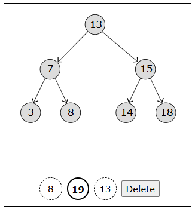
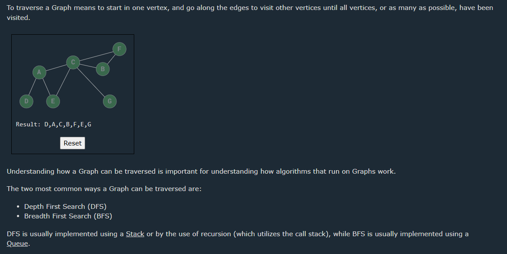

# Why JavaScript is suitable for DSA:
First-class functions and dynamic typing make it flexible.
Built-in data structures like arrays, objects, maps, and sets.
Browser-based visualization is easier (e.g., using HTML/CSS/Canvas).
Node.js allows you to run JavaScript outside the browser for backend and algorithm practice.
📚 Topics You Can Cover in JavaScript:
1. Basic Data Structures
Arrays, Strings
Objects (Hash Tables)
Stacks, Queues
Linked Lists (Singly, Doubly, Circular)
2. Trees and Graphs
Binary Trees, BSTs
Heaps, Tries
Graphs (Adjacency List/Matrix)
DFS, BFS, Dijkstra, A*
3. Advanced Structures
Segment Trees
Fenwick Trees (Binary Indexed Trees)
Union-Find (Disjoint Set)
LRU Cache (using Map + Doubly Linked List)
4. Algorithms
Sorting (Quick, Merge, Heap, etc.)
Searching (Binary Search, Ternary Search)
Recursion and Backtracking
Dynamic Programming
Greedy Algorithms
Divide and Conquer
Sliding Window, Two Pointers
5. Problem Solving
LeetCode, HackerRank, Codeforces, etc., support JavaScript.
You can practice real-world problems and competitive challenges.
🛠 Example: Stack in JavaScript


# Types of Sorting in DSA

#### Comparison Baesd

Bubble    Sort\
Selection Sort\
Insertion Sort\
Quick     sort\
Merge     Sort\
Heap      Sort\

#### Non-Comparison Baesd

Counting Sort\
Radix    Sort\
Bucket   Sort\
Shell    Sort


| Topic                        | Description                                                                                   | Example/Key Points                                                                                   |
|------------------------------|-----------------------------------------------------------------------------------------------|------------------------------------------------------------------------------------------------------|
| **Sorting Algorithms**       | Arranging data in a particular order (ascending/descending).                                  | Bubble, Selection, Insertion, Quick, Merge, Heap, Counting, Radix, Bucket, Shell                     |
| Bubble Sort                  | Repeatedly swaps adjacent elements if they are in wrong order.                                | Simple, O(n²), stable, best O(n)                                                                     |
| Selection Sort               | Selects minimum and swaps with front.                                                         | O(n²), not stable, few swaps                                                                         |
| Insertion Sort               | Builds sorted array one element at a time.                                                    | O(n²), stable, adaptive, best O(n)                                                                   |
| Quick Sort                   | Divide and conquer, uses pivot to partition.                                                  | O(n log n) avg, O(n²) worst, not stable                                                              |
| Merge Sort                   | Divide and conquer, merges sorted halves.                                                     | O(n log n), stable, good for linked lists                                                            |
| Heap Sort                    | Uses heap data structure to sort.                                                             | O(n log n), not stable, in-place                                                                     |
| Counting Sort                | Counts occurrences, only for integers in small range.                                         | O(n + k), stable, non-comparison                                                                     |
| Radix Sort                   | Sorts by digit, uses stable sort as subroutine.                                               | O(nk), stable, non-comparison                                                                        |
| Bucket Sort                  | Distributes into buckets, sorts each, merges.                                                 | O(n + k), stable, for uniformly distributed data                                                     |
| Shell Sort                   | Generalized insertion sort with gaps.                                                         | O(n log n) best, O(n²) worst, not stable                                                             |
| **Linked List**              | Linear data structure with nodes pointing to next (and/or previous) node.                     | Singly, Doubly, Circular, Circular Doubly                                                            |
| Singly Linked List           | Each node points to next node.                                                                | Traverse, insert, delete                                                                             |
| Doubly Linked List           | Each node points to next and previous node.                                                   | Traverse forward/backward, insert, delete                                                            |
| Circular Linked List         | Last node points to first node.                                                               | Useful for round-robin, buffer management                                                            |
| Circular Doubly Linked List  | Doubly linked and circular.                                                                   | Traverse in both directions, circular                                                                |
| **Stack**                    | LIFO (Last In First Out) data structure.                                                      | push, pop, peek, isEmpty, size                                                                       |
| Stack (Array)                | Stack implemented using array/list.                                                           | Simple, fast, fixed size                                                                             |
| Stack (Linked List)          | Stack implemented using linked list.                                                          | Dynamic size, no overflow                                                                            |
| **Queue**                    | FIFO (First In First Out) data structure.                                                     | enqueue, dequeue, front, isEmpty, size                                                               |
| Queue (Array)                | Queue using array/list.                                                                       | Simple, but shifting needed                                                                          |
| Queue (Linked List)          | Queue using linked list.                                                                      | Efficient enqueue/dequeue                                                                            |
| Circular Queue               | Queue wraps around to use space efficiently.                                                  | Used in buffering, scheduling                                                                        |
| Priority Queue               | Each element has priority, served based on priority.                                          | Implemented with heap                                                                                |
| **Tree**                     | Hierarchical data structure with nodes.                                                       | Binary Tree, BST, AVL, Heap, B-Tree                                                                  |
| Binary Tree                  | Each node has at most two children.                                                           | Traversals: inorder, preorder, postorder                                                             |
| Binary Search Tree (BST)     | Binary tree with left < root < right property.                                                | Fast search, insert, delete                                                                          |
| AVL Tree                     | Self-balancing BST.                                                                           | Rotations to maintain balance                                                                        |
| Heap                         | Complete binary tree, max/min at root.                                                        | Used in heap sort, priority queue                                                                    |
| B-Tree                       | Generalized BST for databases, file systems.                                                  | Multi-way, balanced                                                                                  |
| Trie                         | Prefix tree for strings/words.                                                                | Fast search, autocomplete                                                                            |
| **Graph**                    | Set of nodes (vertices) connected by edges.                                                   | Directed/Undirected, Weighted/Unweighted, Cyclic/Acyclic                                             |
| Graph Representation         | Ways to store graphs.                                                                         | Adjacency matrix, adjacency list                                                                     |
| Graph Traversal              | Visiting all nodes/edges.                                                                     | BFS (Breadth-First Search), DFS (Depth-First Search)                                                 |
| Shortest Path Algorithms     | Find shortest path between nodes.                                                             | Dijkstra, Bellman-Ford, Floyd-Warshall                                                               |
| Minimum Spanning Tree        | Connect all nodes with minimum total edge weight.                                             | Kruskal, Prim                                                                                        |
| Topological Sort             | Linear ordering of DAG nodes.                                                                 | Used in scheduling                                                                                   |
| **Hashing**                  | Mapping data to fixed-size values (hash codes).                                               | Hash tables, hash maps, collision resolution (chaining, open addressing)                             |
| **Recursion**                | Function calls itself to solve subproblems.                                                   | Used in divide and conquer, tree/graph traversals                                                    |
| **Dynamic Programming**      | Solving problems by breaking into overlapping subproblems and storing results.                | Memoization, tabulation, examples: Fibonacci, knapsack, LIS                                          |
| **Greedy Algorithms**        | Make locally optimal choices at each step.                                                    | Activity selection, coin change, Huffman coding                                                      |
| **Divide and Conquer**       | Divide problem into subproblems, solve recursively, combine results.                          | Merge sort, quick sort, binary search                                                                |
| **Backtracking**             | Try all possibilities, backtrack on failure.                                                  | N-Queens, Sudoku, permutations/combinations                                                          |
| **Bit Manipulation**         | Algorithms using bitwise operations.                                                          | Set/clear/toggle bits, count set bits, bit masks                                                     |
| **Searching Algorithms**     | Find element in data structure.                                                               | Linear search, binary search                                                                         |
| **Mathematical Algorithms**  | Algorithms for mathematical problems.                                                         | GCD, LCM, prime check, sieve of Eratosthenes                                                         |
| **String Algorithms**        | Algorithms for string processing.                                                             | Pattern matching (KMP, Rabin-Karp), palindrome, anagrams, substring search                           |
| **Miscellaneous**            | Other important DSA topics.                                                                   | Union-Find (Disjoint Set), Segment Tree, Fenwick Tree (Binary Indexed Tree), LRU Cache, etc.         |

### Ref

>https://www.programiz.com/dsa/sorting-algorithm

>https://www.w3schools.com/dsa/dsa_algo_selectionsort.php


# Bubble Sort

>Bubble Sort is an algorithm that sorts an array from the lowest value to the highest value.

Example Bubble Sort :-
```python
	my_array = [64, 34, 25, 12, 22, 11, 90, 5]

	n = len(my_array)
	for i in range(n-1):
		for j in range(n-i-1):
			if my_array[j] > my_array[j+1]:
				my_array[j], my_array[j+1] = my_array[j+1], my_array[j]

	print("Sorted array:", my_array)
```	
---------------------------------------------------------------------------------------------------------------------	
```python	
Bubble sort Improvment :-  my_array = [7, 3, 9, 12, 11]

        my_array = [7, 3, 9, 12, 11]

        n = len(my_array)
        for i in range(n-1):
            swapped = False
            for j in range(n-i-1):
                if my_array[j] > my_array[j+1]:
                    my_array[j], my_array[j+1] = my_array[j+1], my_array[j]
                    swapped = True
            if not swapped:
                break

        print("Sorted array:", my_array)
```
------------------------------------------------------------------------------------------------------------------	
	
### Bubble Sort Time Complexity :-

The Bubble Sort algorithm loops through every value in the array, comparing it to the value next to it. So for an array of 
n values, there must be n such comparisons in one loop. And after one loop, the array is looped through again and again n times.

>This means there are n * n comparisons done in total, so the time complexity for Bubble Sort is: ***O(n2)***
	


### The best-case time complexity of Bubble Sort is : O(n)

In the best case, the array is already sorted. Bubble Sort includes a mechanism to detect this by checking if any swaps were made during a pass. If no swaps occur, the algorithm terminates early.

Pass 1: Compares adjacent elements but makes no swaps.
Early exit: Since no swaps were made, the algorithm concludes the array is sorted.
This results in only one pass through the array, hence linear time complexity.

### The worst-case time complexity of Bubble Sort is : O(n²)

In the worst case, the array is sorted in reverse order. Bubble Sort will:

Perform n−1 passes through the array.
On each pass, it compares and swaps adjacent elements to "bubble" the largest unsorted element to its correct position.
Each pass involves up to n−i comparisons (where i is the pass number).


# Selection Sort

>The Selection Sort algorithm finds the lowest value in an array and moves it to the front of the array.


Example Selection Sort :-
```python
    my_array = [64, 34, 25, 5, 22, 11, 90, 12]

    n = len(my_array)
    for i in range(n-1):
        min_index = i
        for j in range(i+1, n):
            if my_array[j] < my_array[min_index]:
                min_index = j
        min_value = my_array.pop(min_index)
        my_array.insert(i, min_value)

    print("Sorted array:", my_array)
```

### Selection Sort Shifting Problem

The Selection Sort algorithm can be improved a little bit more.

In the code above, the lowest value element is removed, and then inserted in front of the array.

Each time the next lowest value array element is removed, all following elements must be shifted one place down to make up for the removal.


These shifting operation takes a lot of time, and we are not even done yet! After the lowest value (5) is found and removed, it is inserted at the start of the array, causing all following values to shift one position up to make space for the new value, like the image below shows.


 >Solution: Swap Values!

Instead of all the shifting, swap the lowest value (5) with the first value (64) like below.


 >Here is an implementation of the improved Selection Sort, using swapping:
```python
    my_array = [64, 34, 25, 12, 22, 11, 90, 5]

    n = len(my_array)
    for i in range(n):
        min_index = i
        for j in range(i+1, n):
            if my_array[j] < my_array[min_index]:
                min_index = j   
        my_array[i], my_array[min_index] = my_array[min_index], my_array[i]

    print("Sorted array:", my_array)
```

 ### Selection Sort Time Complexity

Selection Sort sorts an array of n values.

On average, about n / 2 elements are compared to find the lowest value in each loop.

And Selection Sort must run the loop to find the lowest value approximately n times.

We get time complexity:


>The most significant difference from Bubble sort that we can notice in this simulation is that best and worst case is actually almost the same for Selection Sort ***(O(n2))***, but for Bubble Sort the best case runtime is only ***O(n)***.


# Insertion Sort

>The Insertion Sort algorithm uses one part of the array to hold the sorted values, and the other part of the array to hold values that are not sorted yet.

Example Insertion Sort :-
```python
    my_array = [64, 34, 25, 12, 22, 11, 90, 5]

    n = len(my_array)
    for i in range(1,n):
        insert_index = i
        current_value = my_array.pop(i)
        for j in range(i-1, -1, -1):
            if my_array[j] > current_value:
                insert_index = j
        my_array.insert(insert_index, current_value)

    print("Sorted array:", my_array)
```

 ## Insertion Sort Improvement


### ***Imporoved Solution Only Applicable for High level Programming languages like python and java script***


```python
    my_array = [64, 34, 25, 12, 22, 11, 90, 5]

    n = len(my_array)
    for i in range(1,n):
        insert_index = i
        current_value = my_array[i]
        for j in range(i-1, -1, -1):
            if my_array[j] > current_value:
                my_array[j+1] = my_array[j]
                insert_index = j
            else:
                break
        my_array[insert_index] = current_value

    print("Sorted array:", my_array)
```
> ***JAVA CODE REMAIN SAME***

```Java
    public class Main {
        public static void main(String[] args) {
            int[] myArray = {64, 34, 25, 12, 22, 11, 90, 5};

            int n = myArray.length;
            for (int i = 1; i < n; i++) {
                int insertIndex = i;
                int currentValue = myArray[i];
                int j = i - 1;

                while (j >= 0 && myArray[j] > currentValue) {
                    myArray[j + 1] = myArray[j];
                    insertIndex = j;
                    j--;
                }
                myArray[insertIndex] = currentValue;
            }

            System.out.print("Sorted array: ");
            for (int value : myArray) {
                System.out.print(value + " ");
            }
        }
    }

    //Java
```
## Insertion Sort Time Complexity


# Quicksort

> As the name suggests, Quicksort is one of the fastest sorting algorithms.
The Quicksort algorithm takes an array of values, chooses one of the values as the 'pivot' element, and moves the other values so that lower values are on the left of the pivot element, and higher values are on the right of it.

To implement the Quicksort algorithm in a programming language, we need:

1. An array with values to sort.
2. A quickSort method that calls itself (recursion) if the sub-array has a size larger than 1.
3. A partition method that receives a sub-array, moves values around, swaps the pivot element into the sub-array and returns the index where the next split in sub-arrays happens.

```python
    def partition(array, low, high):
        pivot = array[high]
        i = low - 1

        for j in range(low, high):
            if array[j] <= pivot:
                i += 1
                array[i], array[j] = array[j], array[i]

        array[i+1], array[high] = array[high], array[i+1]
        return i+1

    def quicksort(array, low=0, high=None):
        if high is None:
            high = len(array) - 1

        if low < high:
            pivot_index = partition(array, low, high)
            quicksort(array, low, pivot_index-1)
            quicksort(array, pivot_index+1, high)

    my_array = [64, 34, 25, 12, 22, 11, 90, 5]
    quicksort(my_array)
    print("Sorted array:", my_array)
```
>***Java Code***

```Java
public class Main {
    public static void main(String[] args) {
        int[] myArray = {64, 34, 25, 12, 22, 11, 90, 5};
        quicksort(myArray, 0, myArray.length - 1);

        System.out.print("Sorted array: ");
        for (int value : myArray) {
            System.out.print(value + " ");
        }
    }

    public static void quicksort(int[] array, int low, int high) {
        if (low < high) {
            int pivotIndex = partition(array, low, high);
            quicksort(array, low, pivotIndex - 1);
            quicksort(array, pivotIndex + 1, high);
        }
    }

    public static int partition(int[] array, int low, int high) {
        int pivot = array[high];
        int i = low - 1;

        for (int j = low; j < high; j++) {
            if (array[j] <= pivot) {
                i++;
                int temp = array[i];
                array[i] = array[j];
                array[j] = temp;
            }
        }

        int temp = array[i + 1];
        array[i + 1] = array[high];
        array[high] = temp;
        return i + 1;
    }
}

//Java
```

### Quicksort Time Complexity


# Counting Sort

>The Counting Sort algorithm sorts an array by counting the number of times each value occurs.

Run the simulation to see how 17 integer values from 1 till 5 are sorted using Counting Sort.

Counting Sort does not compare values like the previous sorting algorithms we have looked at, and only works on non-negative integers.

Furthermore, Counting Sort is fast when the range of possible values \( k \) is smaller than the number of values \( n \).


Example of Counting Sort :-

```python
def countingSort(arr):
    max_val = max(arr)
    count = [0] * (max_val + 1)

    while len(arr) > 0:
        num = arr.pop(0)
        count[num] += 1

    for i in range(len(count)):
        while count[i] > 0:
            arr.append(i)
            count[i] -= 1

    return arr

unsortedArr = [4, 2, 2, 6, 3, 3, 1, 6, 5, 2, 3]
sortedArr = countingSort(unsortedArr)
print("Sorted array:", sortedArr)
```

### Counting Sort Implementation
To implement the Counting Sort algorithm in a programming language, we need:

1. An array with values to sort.
2. A 'countingSort' method that receives an array of integers.
3. An array inside the method to keep count of the values.
4. A loop inside the method that counts and removes values, by incrementing elements in the counting array.
5. A loop inside the method that recreates the array by using the counting array, so that the elements appear in the right order.

One more thing: We need to find out what the highest value in the array is, so that the counting array can be created with the correct size. For example, if the highest value is 5, the counting array must be 6 elements in total, to be able count all possible non negative integers 0, 1, 2, 3, 4 and 5.

Here, **n** is the number of elements in the array to be sorted, and **k** is the range of possible values in the array (specifically, the maximum value in the array plus one if starting from zero).

- **n** = number of items to sort (array length)
- **k** = range of input values (max value - min value + 1)

**Example:**  
If you have the array `[2, 5, 3, 2, 8]`,  
- n = 5 (five elements)
- k = 8 + 1 = 9 (values range from 0 to 8, so k = 9)

Counting Sort is efficient when **k** is not much larger than **n**.

### Time Complexity


# Radix Sort

> The Radix Sort algorithm sorts an array by individual digits, starting with the least significant digit (the rightmost one).

## How Radix Sort Works

Radix Sort processes each digit of the numbers, one digit at a time, from the least significant digit (LSD) to the most significant digit (MSD). It uses a stable sub-sorting algorithm (often Counting Sort) to sort the numbers based on each digit.

### Steps:
1. Find the maximum number to know the number of digits.
2. Starting from the least significant digit, sort the array using a stable sort (like Counting Sort) according to the current digit.
3. Repeat the process for each digit, moving towards the most significant digit.

### Example

Suppose we have the array: `[170, 45, 75, 90, 802, 24, 2, 66]`

- **Step 1:** Sort by units place (1s digit):  
  `[170, 90, 802, 2, 24, 45, 75, 66]`
- **Step 2:** Sort by tens place (10s digit):  
  `[802, 2, 24, 45, 66, 170, 75, 90]`
- **Step 3:** Sort by hundreds place (100s digit):  
  `[2, 24, 45, 66, 75, 90, 170, 802]`

Now the array is sorted.

### Time Complexity

- **O(nk)**, where n is the number of elements and k is the number of digits in the largest number.

### When to Use

- Efficient for sorting large lists of integers or strings with a fixed length.
- Not comparison-based, so it can be faster than comparison sorts for certain data.

### Python Example

```python
def counting_sort(arr, exp):
    n = len(arr)
    output = [0] * n
    count = [0] * 10

    for i in range(n):
        index = (arr[i] // exp) % 10
        count[index] += 1

    for i in range(1, 10):
        count[i] += count[i - 1]

    i = n - 1
    while i >= 0:
        index = (arr[i] // exp) % 10
        output[count[index] - 1] = arr[i]
        count[index] -= 1
        i -= 1

    for i in range(n):
        arr[i] = output[i]

def radix_sort(arr):
    max_num = max(arr)
    exp = 1
    while max_num // exp > 0:
        counting_sort(arr, exp)
        exp *= 10

arr = [170, 45, 75, 90, 802, 24, 2, 66]
radix_sort(arr)
print("Sorted array:", arr)
```

```python
def bubbleSort(arr):
    n = len(arr)
    for i in range(n):
        for j in range(0, n - i - 1):
            if arr[j] > arr[j + 1]:
                arr[j], arr[j + 1] = arr[j + 1], arr[j]
                
def radixSortWithBubbleSort(arr):
    max_val = max(arr)
    exp = 1
    
    while max_val // exp > 0:
        radixArray = [[],[],[],[],[],[],[],[],[],[]]
        
        for num in arr:
            radixIndex = (num // exp) % 10
            radixArray[radixIndex].append(num)
        
        for bucket in radixArray:
            bubbleSort(bucket)
        
        i = 0
        for bucket in radixArray:
            for num in bucket:
                arr[i] = num
                i += 1
        
        exp *= 10

myArray = [170, 45, 75, 90, 802, 24, 2, 66]
print("Original array:", myArray)
radixSortWithBubbleSort(myArray)
print("Sorted array:", myArray)
```

## Radix Sort Time Complexity


# Merge Sort


## Difference Between All Types of Sorting Algorithms

Sorting algorithms can be broadly classified into **Comparison-Based** and **Non-Comparison-Based** sorts. Here’s a brief discussion of each, with examples:

---

### 1. Bubble Sort
- **Type:** Comparison-Based
- **How it works:** Repeatedly steps through the list, compares adjacent elements, and swaps them if they are in the wrong order. This process is repeated until the list is sorted.
- **Example:**  
  `[5, 3, 8, 4]` → `[3, 5, 4, 8]` → `[3, 4, 5, 8]`
- **Time Complexity:** Best O(n), Worst O(n²)
- **Use Case:** Simple, educational, not used for large datasets.

---

### 2. Selection Sort
- **Type:** Comparison-Based
- **How it works:** Finds the minimum element from the unsorted part and puts it at the beginning. Repeats for all positions.
- **Example:**  
  `[5, 3, 8, 4]` → `[3, 5, 8, 4]` → `[3, 4, 8, 5]` → `[3, 4, 5, 8]`
- **Time Complexity:** O(n²) for all cases
- **Use Case:** When memory writes are costly.

---

### 3. Insertion Sort
- **Type:** Comparison-Based
- **How it works:** Builds the sorted array one item at a time by inserting each element into its correct position.
- **Example:**  
  `[5, 3, 8, 4]` → `[3, 5, 8, 4]` → `[3, 5, 8, 4]` → `[3, 4, 5, 8]`
- **Time Complexity:** Best O(n), Worst O(n²)
- **Use Case:** Efficient for small or nearly sorted arrays.

---

### 4. Quick Sort
- **Type:** Comparison-Based, Divide and Conquer
- **How it works:** Picks a 'pivot' element, partitions the array into two sub-arrays (less than and greater than pivot), and recursively sorts them.
- **Example:**  
  `[5, 3, 8, 4]` (pivot 4) → `[3] [4] [5, 8]` → `[3, 4, 5, 8]`
- **Time Complexity:** Best/Average O(n log n), Worst O(n²)
- **Use Case:** General-purpose, fast for large datasets.

---

### 5. Merge Sort
- **Type:** Comparison-Based, Divide and Conquer
- **How it works:** Divides the array into halves, sorts each half, and merges them back together.
- **Example:**  
  `[5, 3, 8, 4]` → `[5, 3] [8, 4]` → `[3, 5] [4, 8]` → `[3, 4, 5, 8]`
- **Time Complexity:** O(n log n) for all cases
- **Use Case:** Stable sort, good for linked lists and large datasets.

---

### 6. Heap Sort
- **Type:** Comparison-Based
- **How it works:** Converts the array into a heap, repeatedly extracts the maximum element, and rebuilds the heap.
- **Example:**  
  `[5, 3, 8, 4]` → build max heap `[8, 5, 3, 4]` → extract max and rebuild
- **Time Complexity:** O(n log n)
- **Use Case:** When constant space is needed (in-place sort).

---

### 7. Counting Sort
- **Type:** Non-Comparison-Based
- **How it works:** Counts the number of occurrences of each value, then calculates positions.
- **Example:**  
  `[4, 2, 2, 8, 3, 3, 1]` → count occurrences → build sorted array
- **Time Complexity:** O(n + k), where k is the range of input
- **Use Case:** Only for integers in a small range.

---

### 8. Radix Sort
- **Type:** Non-Comparison-Based
- **How it works:** Sorts numbers digit by digit, starting from least significant digit.
- **Example:**  
  `[170, 45, 75, 90, 802, 24, 2, 66]` → sort by units, then tens, then hundreds
- **Time Complexity:** O(nk), where k is the number of digits
- **Use Case:** Large lists of integers or strings.

---

### 9. Bucket Sort
- **Type:** Non-Comparison-Based
- **How it works:** Distributes elements into buckets, sorts each bucket, and concatenates them.
- **Example:**  
  `[0.42, 4.21, 0.33, 0.52, 0.25]` → distribute into buckets → sort buckets → merge
- **Time Complexity:** O(n + k)
- **Use Case:** Uniformly distributed floating-point numbers.

---

### 10. Shell Sort
- **Type:** Comparison-Based
- **How it works:** Generalization of insertion sort that allows the exchange of items far apart by sorting elements at specific intervals (gaps).
- **Example:**  
  `[5, 3, 8, 4]` → gap 2: compare and swap → gap 1: insertion sort
- **Time Complexity:** Best O(n log n), Worst O(n²)
- **Use Case:** In-place, better than insertion sort for medium-sized arrays.

---

## Summary Table

| Algorithm      | Type           | Best      | Average   | Worst     | Stable | Use Case/Notes                       |
|----------------|---------------|-----------|-----------|-----------|--------|--------------------------------------|
| Bubble Sort    | Comparison    | O(n)      | O(n²)     | O(n²)     | Yes    | Simple, educational                  |
| Selection Sort | Comparison    | O(n²)     | O(n²)     | O(n²)     | No     | Few swaps, not adaptive              |
| Insertion Sort | Comparison    | O(n)      | O(n²)     | O(n²)     | Yes    | Good for small/nearly sorted arrays  |
| Quick Sort     | Comparison    | O(n log n)| O(n log n)| O(n²)     | No     | Fast, general-purpose                |
| Merge Sort     | Comparison    | O(n log n)| O(n log n)| O(n log n)| Yes    | Stable, good for linked lists        |
| Heap Sort      | Comparison    | O(n log n)| O(n log n)| O(n log n)| No     | In-place, not stable                 |
| Counting Sort  | Non-Comp      | O(n + k)  | O(n + k)  | O(n + k)  | Yes    | Only for small integer ranges        |
| Radix Sort     | Non-Comp      | O(nk)     | O(nk)     | O(nk)     | Yes    | Integers/strings, non-comparison     |
| Bucket Sort    | Non-Comp      | O(n + k)  | O(n + k)  | O(n²)     | Yes    | Uniformly distributed data           |
| Shell Sort     | Comparison    | O(n log n)| O(n^1.5)  | O(n²)     | No     | In-place, better than insertion sort |

---


## Difference Between Selection Sort and Insertion Sort

**Selection Sort** and **Insertion Sort** are both simple, comparison-based sorting algorithms, but they work differently:

### Selection Sort
- **How it works:** Repeatedly finds the minimum element from the unsorted part and puts it at the beginning.
- **Number of swaps:** Performs at most n swaps (one per pass).
- **Number of comparisons:** Always makes O(n²) comparisons, regardless of the initial order.
- **Best, Average, Worst Case:** All are O(n²).
- **Stability:** Not stable by default.
- **When to use:** Useful when the cost of swapping is high and the number of swaps needs to be minimized.

### Insertion Sort
- **How it works:** Builds the sorted array one element at a time by inserting each new element into its correct position in the already sorted part.
- **Number of swaps/shifts:** Can require many shifts, especially if the array is in reverse order.
- **Number of comparisons:** O(n) in the best case (already sorted), O(n²) in the worst case.
- **Best Case:** O(n) (when the array is already sorted).
- **Average/Worst Case:** O(n²).
- **Stability:** Stable.
- **When to use:** Efficient for small or nearly sorted arrays.

**Summary Table:**

| Feature            | Selection Sort         | Insertion Sort         |
|--------------------|-----------------------|------------------------|
| Approach           | Select min, swap       | Insert in place        |
| Comparisons        | O(n²)                  | O(n) best, O(n²) worst |
| Swaps/Shifts       | O(n) swaps             | O(n²) shifts           |
| Stability          | Not stable             | Stable                 |
| Best Case          | O(n²)                  | O(n)                   |
| Adaptive           | No                     | Yes                    |


# Linked List


```python
class Node:
    def __init__(self, data):
        self.data = data
        self.next = None
    
node1 = Node(3)
node2 = Node(5)
node3 = Node(13)
node4 = Node(2)

node1.next = node2
node2.next = node3
node3.next = node4

currentNode = node1
while currentNode:
    print(currentNode.data, end=" -> ")
    currentNode = currentNode.next
print("null")

#Python
```


## Types of Linked Lists
### There are three basic forms of linked lists:

> Singly linked lists  
> Doubly linked lists \
> Circular linked lists


# Linked List Implementations

### 1. Singly Linked List Implementation

```python
class Node:
    def __init__(self, data):
        self.data = data
        self.next = None
    
node1 = Node(3)
node2 = Node(5)
node3 = Node(13)
node4 = Node(2)

node1.next = node2
node2.next = node3
node3.next = node4

currentNode = node1
while currentNode:
    print(currentNode.data, end=" -> ")
    currentNode = currentNode.next
print("null")
```

### 2. Doubly Linked List Implementation

```python
class Node:
    def __init__(self, data):
        self.data = data
        self.next = None
        self.prev = None
    
node1 = Node(3)
node2 = Node(5)
node3 = Node(13)
node4 = Node(2)

node1.next = node2

node2.prev = node1
node2.next = node3

node3.prev = node2
node3.next = node4

node4.prev = node3

print("\nTraversing forward:")
currentNode = node1
while currentNode:
    print(currentNode.data, end=" -> ")
    currentNode = currentNode.next
print("null")

print("\nTraversing backward:")
currentNode = node4
while currentNode:
    print(currentNode.data, end=" -> ")
    currentNode = currentNode.prev
print("null")
```

### 3. Circular Singly Linked List Implementation

```python
class Node:
    def __init__(self, data):
        self.data = data
        self.next = None
    
node1 = Node(3)
node2 = Node(5)
node3 = Node(13)
node4 = Node(2)

node1.next = node2
node2.next = node3
node3.next = node4
node4.next = node1

currentNode = node1
startNode = node1
print(currentNode.data, end=" -> ") 
currentNode = currentNode.next 

while currentNode != startNode:
    print(currentNode.data, end=" -> ")
    currentNode = currentNode.next

print("...")

Line 14: This makes the singly list circular.

Line 17: This is how the program knows when to stop so that it only goes through the list one time.

```


### 4. Circular Doubly Linked List Implementation


```python
class Node:
    def __init__(self, data):
        self.data = data
        self.next = None
        self.prev = None

node1 = Node(3)
node2 = Node(5)
node3 = Node(13)
node4 = Node(2)

node1.next = node2
node1.prev = node4

node2.prev = node1
node2.next = node3

node3.prev = node2
node3.next = node4

node4.prev = node3
node4.next = node1

print("\nTraversing forward:")
currentNode = node1
startNode = node1
print(currentNode.data, end=" -> ")
currentNode = currentNode.next

while currentNode != startNode:
    print(currentNode.data, end=" -> ")
    currentNode = currentNode.next
print("...")

print("\nTraversing backward:")
currentNode = node4
startNode = node4
print(currentNode.data, end=" -> ")
currentNode = currentNode.prev

while currentNode != startNode:
    print(currentNode.data, end=" -> ")
    currentNode = currentNode.prev
print("...")

Lines 13 and 22: These links makes the doubly linked list circular.

Lines 26: This is how the program knows when to stop so that it only goes through the list one time.

```


### Linked List Operations

>***All done on singularly linked list***

>Traverse (or search), and delete python logic

```python
class Node:
    def __init__(self, data):
        self.data = data
        self.next = None

def traverseAndPrint(head):
    currentNode = head
    while currentNode:
        print(currentNode.data, end=" -> ")
        currentNode = currentNode.next
    print("null")

def deleteSpecificNode(head, nodeToDelete):

    if head == nodeToDelete:
        return head.next

    currentNode = head
    while currentNode.next and currentNode.next != nodeToDelete:
        currentNode = currentNode.next

    if currentNode.next is None:
        return head

    currentNode.next = currentNode.next.next

    return head

node1 = Node(7)
node2 = Node(11)
node3 = Node(3)
node4 = Node(2)
node5 = Node(9)

node1.next = node2
node2.next = node3
node3.next = node4
node4.next = node5

print("Before deletion:")
traverseAndPrint(node1)

# Delete node4
node1 = deleteSpecificNode(node1, node4)

print("\nAfter deletion:")
traverseAndPrint(node1)

```
> Insert into linked list 

```python
def insertNodeAtPosition(head, newNode, position):
    if position == 1:
        newNode.next = head
        return newNode
    
    currentNode = head
    for _ in range(position - 2):
        if currentNode is None:
            break
        currentNode = currentNode.next

    newNode.next = currentNode.next
    currentNode.next = newNode
    return head

```


# Stacks

>LIFO: Last In First Out.

### Basic operations we can do on a stack are:

1. **Push:** Adds a new element on the stack.  
2. **Pop:** Removes and returns the top element from the stack.  
3. **Peek:** Returns the top element on the stack.  
4. **isEmpty:** Checks if the stack is empty.  
5. **Size:** Finds the number of elements in the stack.

>Stacks can be implemented by using arrays or linked lists.

>Stacks can be used to implement undo mechanisms, to revert to previous states, to create algorithms for depth-first search in graphs, or for backtracking.

>Stacks are often mentioned together with Queues, which is a similar data structure described on the next page.

### Stack implementaton using Array
```python
class Stack:
    def __init__(self):
        self.stack = []
    
    def push(self, element):
        self.stack.append(element)
    
    def pop(self):
        if self.isEmpty():
            return "Stack is empty"
        return self.stack.pop()
    
    def peek(self):
        if self.isEmpty():
            return "Stack is empty"
        return self.stack[-1]
    
    def isEmpty(self):
        return len(self.stack) == 0
    
    def size(self):
        return len(self.stack)

# Create a stack
myStack = Stack()

myStack.push('A')
myStack.push('B')
myStack.push('C')
print("Stack: ", myStack.stack)

print("Pop: ", myStack.pop())

print("Peek: ", myStack.peek())

print("isEmpty: ", myStack.isEmpty())

print("Size: ", myStack.size())

```

### Stack implementaton using Linked List

```python
class Node:
    def __init__(self, value):
        self.value = value
        self.next = None

class Stack:
    def __init__(self):
        self.head = None
        self.size = 0
    
    def push(self, value):
        new_node = Node(value)
        if self.head:
            new_node.next = self.head
        self.head = new_node
        self.size += 1
    
    def pop(self):
        if self.isEmpty():
            return "Stack is empty"
        popped_node = self.head
        self.head = self.head.next
        self.size -= 1
        return popped_node.value
    
    def peek(self):
        if self.isEmpty():
            return "Stack is empty"
        return self.head.value
    
    def isEmpty(self):
        return self.size == 0
    
    def stackSize(self):
        return self.size

# Usage
myStack = Stack()
myStack.push('A')
myStack.push('B')
myStack.push('C')

print("Pop: ", myStack.pop())
print("Peek: ", myStack.peek())
print("isEmpty: ", myStack.isEmpty())
print("Size: ", myStack.stackSize())

#Python

```

# Queues
>A queue is a data structure that can hold many elements.
>The first person to stand in line is also the first who can pay and leave the supermarket. This way of organizing elements is called FIFO: First In First Out.


### 

Basic operations we can do on a queue are:

1. **Enqueue:** Adds a new element to the queue.  
2. **Dequeue:** Removes and returns the first (front) element from the queue.  
3. **Peek:** Returns the first element in the queue.  
4. **isEmpty:** Checks if the queue is empty.  
5. **Size:** Finds the number of elements in the queue.

>Queues can be implemented by using arrays or linked lists.

>Queues can be used to implement job scheduling for an office printer, order processing for e-tickets, or to create algorithms for breadth-first search in graphs.

### Queue Implementation using Arrays

```python
class Queue:
    def __init__(self):
        self.queue = []
    
    def enqueue(self, element):
        self.queue.append(element)
    
    def dequeue(self):
        if self.isEmpty():
            return "Queue is empty"
        return self.queue.pop(0)
    
    def peek(self):
        if self.isEmpty():
            return "Queue is empty"
        return self.queue[0]
    
    def isEmpty(self):
        return len(self.queue) == 0
    
    def size(self):
        return len(self.queue)

# Create a queue
myQueue = Queue()

myQueue.enqueue('A')
myQueue.enqueue('B')
myQueue.enqueue('C')
print("Queue: ", myQueue.queue)

print("Dequeue: ", myQueue.dequeue())

print("Peek: ", myQueue.peek())

print("isEmpty: ", myQueue.isEmpty())

print("Size: ", myQueue.size())

```

### Queue Implementation using Linked Lists

```python
class Node:
    def __init__(self, data):
        self.data = data
        self.next = None

class Queue:
    def __init__(self):
        self.front = None
        self.rear = None
        self.length = 0
    
    def enqueue(self, element):
        new_node = Node(element)
        if self.rear is None:
            self.front = self.rear = new_node
            self.length += 1
            return
        self.rear.next = new_node
        self.rear = new_node
        self.length += 1
    
    def dequeue(self):
        if self.isEmpty():
            return "Queue is empty"
        temp = self.front
        self.front = temp.next
        self.length -= 1
        if self.front is None:
            self.rear = None
        return temp.data
    
    def peek(self):
        if self.isEmpty():
            return "Queue is empty"
        return self.front.data
    
    def isEmpty(self):
        return self.length == 0
    
    def size(self):
        return self.length

    def printQueue(self):
        temp = self.front
        while temp:
            print(temp.data, end=" ")
            temp = temp.next
        print()

# Create a queue
myQueue = Queue()

myQueue.enqueue('A')
myQueue.enqueue('B')
myQueue.enqueue('C')
print("Queue: ", end="")
myQueue.printQueue()

print("Dequeue: ", myQueue.dequeue())

print("Peek: ", myQueue.peek())

print("isEmpty: ", myQueue.isEmpty())

print("Size: ", myQueue.size())
```

# Hash Tables

>A Hash Table is a data structure designed to be fast to work with.
The reason Hash Tables are sometimes preferred instead of arrays or linked lists is because searching for, adding, and deleting data can be done really quickly, even for large amounts of data.


***The character "B" has Unicode code point 66, "o" has 111, and "b" has 98. Adding those together we get 275. Modulo 10 of 275 is 5, so "Bob" should be stored as an array element at index 5.***

***The number returned by the hash function is called the hash code.***

```python
my_hash_set = [None,'Jones',None,'Lisa',None,'Bob',None,'Siri','Pete',None]

def hash_function(value):
    sum_of_chars = 0
    for char in value:
        sum_of_chars += ord(char)

    return sum_of_chars % 10
    
def contains(name):
    index = hash_function(name)
    return my_hash_set[index] == name

print("'Pete' is in the Hash Set:",contains('Pete'))
```

>When ***deleting*** a name from our Hash Set, we can also use the hash function to go straight to where the name is, and set that element value to ***None***.

### Handling Collisions

>Let's also add "Stuart" to our Hash Set.
We give "Stuart" to our hash function, and we get the hash code 3, meaning "Stuart" should be stored at index 3.
Trying to store "Stuart" creates what is called a collision, because "Lisa" is already stored at index 3.

>To fix the collision, we can make room for more elements in the same bucket, and solving the collision problem in this way is called chaining. We can give room for more elements in the same bucket by implementing each bucket as a ***linked list, or as an array***.

```python
my_hash_set = [
    [None],
    ['Jones'],
    [None],
    ['Lisa', 'Stuart'],
    [None],
    ['Bob'],
    [None],
    ['Siri'],
    ['Pete'],
    [None]
]
```


### Hash Set code example and simulation

>To complete our very basic Hash Set code, let's have functions for adding and searching for names in the Hash Set, which is now a two dimensional array.

Run the code example below, and try it with different values to get a better understanding of how a Hash Set works.

```python
my_hash_set = [
    [None],
    ['Jones'],
    [None],
    ['Lisa'],
    [None],
    ['Bob'],
    [None],
    ['Siri'],
    ['Pete'],
    [None]
]

def hash_function(value):
    return sum(ord(char) for char in value) % 10
    
def add(value):
    index = hash_function(value)
    bucket = my_hash_set[index]
    if value not in bucket:
        bucket.append(value)
        
def contains(value):
    index = hash_function(value)
    bucket = my_hash_set[index]
    return value in bucket

add('Stuart')

print(my_hash_set)
print('Contains Stuart:',contains('Stuart'))
```


### Uses of Hash Tables

Hash Tables are great for:

Checking if something is in a collection (like finding a book in a library).
Storing unique items and quickly finding them (like storing phone numbers).
Connecting values to keys (like linking names to phone numbers).
The most important reason why Hash Tables are great for these things is that Hash Tables are very fast compared Arrays and Linked Lists, especially for large sets. Arrays and Linked Lists have time complexity 
O(n) for search and delete, while Hash Tables have just O(1) on average!


# Hash Set 

```python
class SimpleHashSet:
    def __init__(self, size=100):
        self.size = size
        self.buckets = [[] for _ in range(size)]  # A list of buckets, each is a list (to handle collisions)

    def hash_function(self, value):
        # Simple hash function: sum of character codes modulo the number of buckets
        return sum(ord(char) for char in value) % self.size

    def add(self, value):
        # Add a value if it's not already present
        index = self.hash_function(value)
        bucket = self.buckets[index]
        if value not in bucket:
            bucket.append(value)

    def contains(self, value):
        # Check if a value exists in the set
        index = self.hash_function(value)
        bucket = self.buckets[index]
        return value in bucket

    def remove(self, value):
        # Remove a value
        index = self.hash_function(value)
        bucket = self.buckets[index]
        if value in bucket:
            bucket.remove(value)

    def print_set(self):
        # Print all elements in the hash set
        print("Hash Set Contents:")
        for index, bucket in enumerate(self.buckets):
            print(f"Bucket {index}: {bucket}")

# Creating the Hash Set from the simulation
hash_set = SimpleHashSet(size=10)

hash_set.add("Charlotte")
hash_set.add("Thomas")
hash_set.add("Jens")
hash_set.add("Peter")
hash_set.add("Lisa")
hash_set.add("Adele")
hash_set.add("Michaela")
hash_set.add("Bob")

hash_set.print_set()

print("\n'Peter' is in the set:",hash_set.contains('Peter'))
print("Removing 'Peter'")
hash_set.remove('Peter')
print("'Peter' is in the set:",hash_set.contains('Peter'))
print("'Adele' has hash code:",hash_set.hash_function('Adele'))

#Python
```

### Hash map Complexity

In cases like this we say that the Hash Map has constant time O(1)
 for searching, adding, and removing entries, which is really fast compared to using an array or a linked list.

But, in a worst case scenario, all the people are stored in the same bucket, and if the person we are trying to find is last person in this bucket, we need to compare with all the other social security numbers in that bucket before we find the person we are looking for.

In such a worst case scenario the Hash Map has time complexity O(n) , which is the same time complexity as arrays and linked lists.

### Hash Map Implementation

```python
class SimpleHashMap:
    def __init__(self, size=100):
        self.size = size
        self.buckets = [[] for _ in range(size)]  # A list of buckets, each is a list (to handle collisions)

    def hash_function(self, key):
        # Sum only the numerical values of the key, ignoring non-numeric characters
        numeric_sum = sum(int(char) for char in key if char.isdigit())
        return numeric_sum % 10  # Perform modulo 10 on the sum

    def put(self, key, value):
        # Add or update a key-value pair
        index = self.hash_function(key)
        bucket = self.buckets[index]
        for i, (k, v) in enumerate(bucket):
            if k == key:
                bucket[i] = (key, value)  # Update existing key
                return
        bucket.append((key, value))  # Add new key-value pair if not found

    def get(self, key):
        # Retrieve a value by key
        index = self.hash_function(key)
        bucket = self.buckets[index]
        for k, v in bucket:
            if k == key:
                return v
        return None  # Key not found

    def remove(self, key):
        # Remove a key-value pair
        index = self.hash_function(key)
        bucket = self.buckets[index]
        for i, (k, v) in enumerate(bucket):
            if k == key:
                del bucket[i]  # Remove the key-value pair
                return

    def print_map(self):
        # Print all key-value pairs in the hash map
        print("Hash Map Contents:")
        for index, bucket in enumerate(self.buckets):
            print(f"Bucket {index}: {bucket}")

# Creating the Hash Map from the simulation
hash_map = SimpleHashMap(size=10)

# Adding some entries
hash_map.put("123-4567", "Charlotte")
hash_map.put("123-4568", "Thomas")
hash_map.put("123-4569", "Jens")
hash_map.put("123-4570", "Peter")
hash_map.put("123-4571", "Lisa")
hash_map.put("123-4672", "Adele")
hash_map.put("123-4573", "Michaela")
hash_map.put("123-6574", "Bob")

hash_map.print_map()

# Demonstrating retrieval
print("\nName associated with '123-4570':", hash_map.get("123-4570"))

print("Updating the name for '123-4570' to 'James'")
hash_map.put("123-4570","James")

# Checking if Peter is still there
print("Name associated with '123-4570':", hash_map.get("123-4570"))
```

# Trees

>We have previously covered data structures like Arrays, Linked Lists, Stacks, and Queues. These are all linear structures, which means that each element follows directly after another in a sequence. Trees however, are different. In a Tree, a single element can have multiple 'next' elements, allowing the data structure to branch out in various directions.

> The Tree data structure can be useful in many cases:

1. Hierarchical Data: File systems, organizational models, etc.
2. Databases: Used for quick data retrieval.
3. Routing Tables: Used for routing data in network algorithms.
4. Sorting/Searching: Used for sorting data and searching for data.
5. Priority Queues: Priority queue data structures are commonly implemented using trees, such as binary heaps.


# Types of Trees

Trees are a fundamental data structure in computer science, used to represent hierarchical relationships. This tutorial covers several key types of trees.

1. ***Binary Trees:*** Each node has up to two children, the left child node and the right child node. This structure is the foundation for more complex tree types like Binay Search Trees and AVL Trees.

2. ***Binary Search Trees (BSTs):*** A type of Binary Tree where for each node, the left child node has a lower value, and the right child node has a higher value.

3. ***AVL Trees:*** A type of Binary Search Tree that self-balances so that for every node, the difference in height between the left and right subtrees is at most one. This balance is maintained through rotations when nodes are inserted or deleted.


# Binary Trees

***A parent node, or internal node, in a Binary Tree is a node with one or two child nodes.***


The left child node is the child node to the left.

The right child node is the child node to the right.

The tree height is the maximum number of edges from the root node to a leaf node.

### Binary Trees vs Arrays and Linked Lists
Benefits of Binary Trees over Arrays and Linked Lists:

1. ***Arrays*** are fast when you want to access an element directly, like element number 700 in an array of 1000 elements for example. But inserting and deleting elements require other elements to shift in memory to make place for the new element, or to take the deleted elements place, and that is time consuming.\

2. ***Linked*** Lists are fast when inserting or deleting nodes, no memory shifting needed, but to access an element inside the list, the list must be traversed, and that takes time.\

3. ***Binary Trees***, such as Binary Search Trees and AVL Trees, are great compared to Arrays and Linked Lists because they are BOTH fast at accessing a node, AND fast when it comes to deleting or inserting a node, with no shifts in memory needed.


### Important terms used in tree 

A ***balanced Binary Tree*** has at most 1 in difference between its left and right subtree heights, for each node in the tree.

A ***complete Binary Tree*** has all levels full of nodes, except the last level, which is can also be full, or filled from left to right. The properties of a complete Binary Tree means it is also balanced.

A ***full Binary Tree*** is a kind of tree where each node has either 0 or 2 child nodes.

A ***perfect Binary Tree*** has all leaf nodes on the same level, which means that all levels are full of nodes, and all internal nodes have two child nodes.The properties of a perfect Binary Tree means it is also full, balanced, and complete.

>***Visual Representation***


### Binary Tree Implementation


```python
class TreeNode:
    def __init__(self, data):
        self.data = data
        self.left = None
        self.right = None

root = TreeNode('R')
nodeA = TreeNode('A')
nodeB = TreeNode('B')
nodeC = TreeNode('C')
nodeD = TreeNode('D')
nodeE = TreeNode('E')
nodeF = TreeNode('F')
nodeG = TreeNode('G')

root.left = nodeA
root.right = nodeB

nodeA.left = nodeC
nodeA.right = nodeD

nodeB.left = nodeE
nodeB.right = nodeF

nodeF.left = nodeG

# Test
print("root.right.left.data:", root.right.left.data)
```

### Binary Tree Traversal

>Going through a Tree by visiting every node, one node at a time, is called traversal.

***Breadth First Search (BFS)*** is when the nodes on the same level are visited before going to the next level in the tree. This means that the tree is explored in a more sideways direction.

***Depth First Search (DFS)*** is when the traversal moves down the tree all the way to the leaf nodes, exploring the tree branch by branch in a downwards direction.

There are three different types of DFS traversals:

1. pre-order
2. in-order
3. post-order

### 1. Pre-order Traversal

Pre-order Traversal is a type of Depth First Search, where each node is visited in a certain order. 


Pre-order Traversal is done by visiting the root node first, then recursively do a pre-order traversal of the left subtree, followed by a recursive pre-order traversal of the right subtree. It's used for creating a copy of the tree, prefix notation of an expression tree, etc.

This traversal is "pre" order because the node is visited "before" the recursive pre-order traversal of the left and right subtrees.

```python
class TreeNode:
    def __init__(self, data):
        self.data = data
        self.left = None
        self.right = None

def preOrderTraversal(node):
    if node is None:
        return
    print(node.data, end=", ")
    preOrderTraversal(node.left)
    preOrderTraversal(node.right)

root = TreeNode('R')
nodeA = TreeNode('A')
nodeB = TreeNode('B')
nodeC = TreeNode('C')
nodeD = TreeNode('D')
nodeE = TreeNode('E')
nodeF = TreeNode('F')
nodeG = TreeNode('G')

root.left = nodeA
root.right = nodeB

nodeA.left = nodeC
nodeA.right = nodeD

nodeB.left = nodeE
nodeB.right = nodeF

nodeF.left = nodeG

# Traverse
preOrderTraversal(root)

#Python
```

### In-order Traversal of Binary Trees
> In-order Traversal is a type of Depth First Search, where each node is visited in a certain order.

>In-order Traversal does a recursive In-order Traversal of the left subtree, visits the root node, and finally, does a recursive In-order Traversal of the right subtree. This traversal is mainly used for Binary Search Trees where it returns values in ascending order.

>What makes this traversal "in" order, is that the node is visited in between the recursive function calls. The node is visited after the In-order Traversal of the left subtree, and before the In-order Traversal of the right subtree.


```python
class TreeNode:
    def __init__(self, data):
        self.data = data
        self.left = None
        self.right = None

def inOrderTraversal(node):
    if node is None:
        return
    inOrderTraversal(node.left)
    print(node.data, end=", ")
    inOrderTraversal(node.right)

root = TreeNode('R')
nodeA = TreeNode('A')
nodeB = TreeNode('B')
nodeC = TreeNode('C')
nodeD = TreeNode('D')
nodeE = TreeNode('E')
nodeF = TreeNode('F')
nodeG = TreeNode('G')

root.left = nodeA
root.right = nodeB

nodeA.left = nodeC
nodeA.right = nodeD

nodeB.left = nodeE
nodeB.right = nodeF

nodeF.left = nodeG

# Traverse
inOrderTraversal(root)

#Python
```

### Post-order Traversal
>Post-order Traversal is a type of Depth First Search, where each node is visited in a certain order. 


>Post-order Traversal works by recursively doing a Post-order Traversal of the left subtree and the right subtree, followed by a visit to the root node. It is used for deleting a tree, post-fix notation of an expression tree, etc.

>What makes this traversal "post" is that visiting a node is done "after" the left and right child nodes are called recursively.

```python
class TreeNode:
    def __init__(self, data):
        self.data = data
        self.left = None
        self.right = None

def postOrderTraversal(node):
    if node is None:
        return
    postOrderTraversal(node.left)
    postOrderTraversal(node.right)
    print(node.data, end=", ")

root = TreeNode('R')
nodeA = TreeNode('A')
nodeB = TreeNode('B')
nodeC = TreeNode('C')
nodeD = TreeNode('D')
nodeE = TreeNode('E')
nodeF = TreeNode('F')
nodeG = TreeNode('G')

root.left = nodeA
root.right = nodeB

nodeA.left = nodeC
nodeA.right = nodeD

nodeB.left = nodeE
nodeB.right = nodeF

nodeF.left = nodeG

# Traverse
postOrderTraversal(root)

#Python
```

### Array Implementation of Binary Trees

>This Binary Tree can be stored in an Array starting with the root node R on index 0. The rest of the tree can be built by taking a node stored on index 
i, and storing its left child node on index ***2⋅i+1***, and its right child node on index ***2⋅i+2*** .


>In this Array implementation, since the Binary Tree nodes are placed in an array, much of the code is about accessing nodes using indexes, and about how to find the correct indexes.


```python
binary_tree_array = ['R', 'A', 'B', 'C', 'D', 'E', 'F', None, None, None, None, None, None, 'G']

def left_child_index(index):
    return 2 * index + 1

def right_child_index(index):
    return 2 * index + 2

def get_data(index):
    if 0 <= index < len(binary_tree_array):
        return binary_tree_array[index]
    return None

right_child = right_child_index(0)
left_child_of_right_child = left_child_index(right_child)
data = get_data(left_child_of_right_child)

print("root.right.left.data:", data)

#Python
```


```python
binary_tree_array = ['R', 'A', 'B', 'C', 'D', 'E', 'F', None, None, None, None, None, None, 'G']

def left_child_index(index):
    return 2 * index + 1

def right_child_index(index):
    return 2 * index + 2

def pre_order(index):
    if index >= len(binary_tree_array) or binary_tree_array[index] is None:
        return []
    return [binary_tree_array[index]] + pre_order(left_child_index(index)) + pre_order(right_child_index(index))

def in_order(index):
    if index >= len(binary_tree_array) or binary_tree_array[index] is None:
        return []
    return in_order(left_child_index(index)) + [binary_tree_array[index]] + in_order(right_child_index(index))

def post_order(index):
    if index >= len(binary_tree_array) or binary_tree_array[index] is None:
        return []
    return post_order(left_child_index(index)) + post_order(right_child_index(index)) + [binary_tree_array[index]]

print("Pre-order Traversal:", pre_order(0))
print("In-order Traversal:", in_order(0))
print("Post-order Traversal:", post_order(0))

#Python
```

### Binary Search Trees

>A Binary Search Tree is a Binary Tree where every node's left child has a lower value, and every node's right child has a higher value.

>A clear advantage with Binary Search Trees is that operations like search, delete, and insert are fast and done without having to shift values in memory.

A Binary Search Tree (BST) is a type of Binary Tree data structure, where the following properties must be true for any node "X" in the tree:

1. The X node's left child and all of its descendants (children, children's children, and so on) have lower values than X's value.
2. The right child, and all its descendants have higher values than X's value.
3. Left and right subtrees must also be Binary Search Trees.

>These properties makes it faster to search, add and delete values than a regular binary tree.

>To make this as easy to understand and implement as possible, let's also assume that all values in a Binary Search Tree are unique.


A subtree starts with one of the nodes in the tree as a local root, and consists of that node and all its descendants.

The ***descendants*** of a node are all the child nodes of that node, and all their child nodes, and so on. Just start with a node, and the descendants will be all nodes that are connected below that node.

The ***node's height is the maximum number*** of edges between that node and a leaf node.

A ***node's in-order successor*** is the node that comes after it if we were to do in-order traversal. In-order traversal of the BST above would result in node 13 coming before node 14, and so the successor of node 13 is node 14.

### Traversal of a Binary Search Tree

Just to confirm that we actually have a Binary Search Tree data structure in front of us, we can check if the properties at the top of this page are true. So for every node in the figure above, check if all the values to the left of the node are lower, and that all values to the right are higher.

>Another way to check if a ***Binary Tree is BST***, is to do an in-order traversal (like we did on the previous page) and check if the resulting list of values are in an increasing order.

```python
class TreeNode:
    def __init__(self, data):
        self.data = data
        self.left = None
        self.right = None

def inOrderTraversal(node):
    if node is None:
        return
    inOrderTraversal(node.left)
    print(node.data, end=", ")
    inOrderTraversal(node.right)

root = TreeNode(13)
node7 = TreeNode(7)
node15 = TreeNode(15)
node3 = TreeNode(3)
node8 = TreeNode(8)
node14 = TreeNode(14)
node19 = TreeNode(19)
node18 = TreeNode(18)

root.left = node7
root.right = node15

node7.left = node3
node7.right = node8

node15.left = node14
node15.right = node19

node19.left = node18

# Traverse
inOrderTraversal(root)

#Python
```

### Search for a Value in a BST

>Searching for a value in a BST is very similar to how we found a value using Binary Search on an array.

>For Binary Search to work, the array must be sorted already, and searching for a value in an array can then be done really fast.

>Similarly, searching for a value in a BST can also be done really fast because of how the nodes are placed.


### How it works (Algorithum):

1. Start at the root node.
2. If this is the value we are looking for, return.
3. If the value we are looking for is higher, continue searching in the right subtree.
4. If the value we are looking for is lower, continue searching in the left subtree.
5. If the subtree we want to search does not exist, depending on the programming language, return None, or NULL, or something similar, to indicate that the value is not inside the BST.


> Searhing number code

```python
class TreeNode:
    def __init__(self, data):
        self.data = data
        self.left = None
        self.right = None

def search(node, target):
    if node is None:
        return None 
    elif node.data == target:
        return node
    elif target < node.data:
        return search(node.left, target)
    else:
        return search(node.right, target)

root = TreeNode(13)
node7 = TreeNode(7)
node15 = TreeNode(15)
node3 = TreeNode(3)
node8 = TreeNode(8)
node14 = TreeNode(14)
node19 = TreeNode(19)
node18 = TreeNode(18)

root.left = node7
root.right = node15

node7.left = node3
node7.right = node8

node15.left = node14
node15.right = node19

node19.left = node18

# Search for a value
result = search(root, 8)
if result:
    print(f"Found the node with value: {result.data}")
else:
    print("Value not found in the BST.")

#Python
```

### Time Complexity


### Insert a Node in a BST


```python
class TreeNode:
    def __init__(self, data):
        self.data = data
        self.left = None
        self.right = None

def insert(node, data):
    if node is None:
        return TreeNode(data)
    else:
        if data < node.data:
            node.left = insert(node.left, data)
        elif data > node.data:
            node.right = insert(node.right, data)
    return node

def inOrderTraversal(node):
    if node is None:
        return
    inOrderTraversal(node.left)
    print(node.data, end=", ")
    inOrderTraversal(node.right)

root = TreeNode(13)
node7 = TreeNode(7)
node15 = TreeNode(15)
node3 = TreeNode(3)
node8 = TreeNode(8)
node14 = TreeNode(14)
node19 = TreeNode(19)
node18 = TreeNode(18)

root.left = node7
root.right = node15

node7.left = node3
node7.right = node8

node15.left = node14
node15.right = node19

node19.left = node18

# Inserting new value into the BST
insert(root, 10)

# Traverse
inOrderTraversal(root)

#Python
```

### Find The Lowest Value in a BST Subtree

>The next section will explain how we can delete a node in a BST, but to do that we need a function that finds the lowest value in a node's subtree.

### How it works (Algorithum):

1. Start at the root node of the subtree.
2. Go left as far as possible.
3. The node you end up in is the node with the lowest value in that BST subtree.

>In the figure below, if we start at node 13 and keep going left, we end up in node 3, which is the lowest value, right?

>And if we start at node 15 and keep going left, we end up in node 14, which is the lowest value in node 15's subtree.


```python
class TreeNode:
    def __init__(self, data):
        self.data = data
        self.left = None
        self.right = None

def inOrderTraversal(node):
    if node is None:
        return
    inOrderTraversal(node.left)
    print(node.data, end=", ")
    inOrderTraversal(node.right)

def minValueNode(node):
    current = node
    while current.left is not None:
        current = current.left
    return current

root = TreeNode(13)
node7 = TreeNode(7)
node15 = TreeNode(15)
node3 = TreeNode(3)
node8 = TreeNode(8)
node14 = TreeNode(14)
node19 = TreeNode(19)
node18 = TreeNode(18)

root.left = node7
root.right = node15

node7.left = node3
node7.right = node8

node15.left = node14
node15.right = node19

node19.left = node18

# Traverse
inOrderTraversal(root)

# Find Lowest
print("\nLowest value:",minValueNode(root).data)

#Python
```

### Delete a Node in a BST

>To delete a node, our function must first search the BST to find it.

>After the node is found there are three different cases where deleting a node must be done differently.

### How it works (Algorithum):

1. If the node is a leaf node, remove it by removing the link to it.
2. If the node only has one child node, connect the parent node of the node you want to remove to that child node.
3. If the node has both right and left child nodes: Find the node's in-order successor, change values with that node, then delete it.

```python
class TreeNode:
    def __init__(self, data):
        self.data = data
        self.left = None
        self.right = None

def inOrderTraversal(node):
    if node is None:
        return
    inOrderTraversal(node.left)
    print(node.data, end=", ")
    inOrderTraversal(node.right)

def minValueNode(node):
    current = node
    while current.left is not None:
        current = current.left
    return current

def delete(node, data):
    if not node:
        return None

    if data < node.data:
        node.left = delete(node.left, data)
    elif data > node.data:
        node.right = delete(node.right, data)
    else:
        # Node with only one child or no child
        if not node.left:
            temp = node.right
            node = None
            return temp
        elif not node.right:
            temp = node.left
            node = None
            return temp

        # Node with two children, get the in-order successor
        node.data = minValueNode(node.right).data
        node.right = delete(node.right, node.data)

    return node

root = TreeNode(13)
node7 = TreeNode(7)
node15 = TreeNode(15)
node3 = TreeNode(3)
node8 = TreeNode(8)
node14 = TreeNode(14)
node19 = TreeNode(19)
node18 = TreeNode(18)

root.left = node7
root.right = node15

node7.left = node3
node7.right = node8

node15.left = node14
node15.right = node19

node19.left = node18

# Traverse
inOrderTraversal(root)

# Delete node 15
delete(root,15)

# Traverse
print() # Creates a new line
inOrderTraversal(root)

# Python
```

1. ***Line 1:*** The node argument here makes it possible for the function to call itself recursively on smaller and smaller subtrees in the search for the node with the data we want to delete.
2. ***Line 2-8:*** This is searching for the node with correct data that we want to delete.
3. ***Line 9-22:*** The node we want to delete has been found. There are three such cases:

    - ***Case 1:*** Node with no child nodes (leaf node). None is returned, and that becomes the parent node's new left or right value by recursion (line 6 or 8).
    - ***Case 2:*** Node with either left or right child node. That left or right child node becomes the parent's new left or right child through recursion (line 7 or 9).
    - ***Case 3:*** Node has both left and right child nodes. The in-order successor is found using the minValueNode() function. We keep the successor's value by setting it as the value of the node we want to delete, and then we can delete the successor node.
4. ***Line 24:*** node is returned to maintain the recursive functionality.

#### Senerios

>***Node 8*** is a leaf node (case 1), so after we find it, we can just delete it.


>***Node 19*** has only one child node (case 2). To delete node 19, the parent node 15 is connected directly to node 18, and then node 19 can be removed.



>***Node 13*** has two child nodes (case 3). We find the successor, the node that comes right after during in-order traversal, by finding the lowest node in node 13's right subtree, which is node 14. Value 14 is put into node 13, and then we can delete node 14.


### BST Compared to Other Data Structures


### BST Balance and Time Complexity

>On a Binary Search Tree, operations like inserting a new node, deleting a node, or searching for a node are actually ***O(h)***. That means that the ***higher the tree is (h)***, the longer the operation will take.


### AVL Trees

>The AVL Tree is a type of Binary Search Tree named after two Soviet inventors Georgy Adelson-Velsky and Evgenii Landis who invented the AVL Tree in 1962.

>AVL trees are self-balancing, which means that the tree height is kept to a minimum so that a very fast runtime is guaranteed for searching, inserting and deleting nodes, with time complexity 
***O(logn)***.

### AVL Tree vs Binary Tree

>The only difference between a regular Binary Search Tree and an AVL Tree is that AVL Trees do rotation operations in addition, to keep the tree balance.

>A Binary Search Tree is in balance when the difference in height between left and right subtrees is less than 2.

>By keeping balance, the AVL Tree ensures a minimum tree height, which means that search, insert, and delete operations can be done really fast.


### Left and Right Rotations


#### Note

>Notice how the subtree changes its parent. Subtrees change parent in this way during rotation to maintain the ***correct in-order traversal, and to maintain the BST property that the left child is less than the right child***, for all nodes in the tree.\
Also keep in ***mind that it is not always the root node that become unbalanced and need rotation***.

### The Balance Factor

>A node's balance factor is the difference in subtree heights.

>The subtree heights are stored at each node for all nodes in an AVL Tree, and the balance factor is calculated based on its subtree heights to check if the tree has become out of balance.

>The height of a subtree is the number of edges between the root node of the subtree and the leaf node farthest down in that subtree.


### The Four "out-of-balance" Cases


#### The Left-Left (LL) Case

>The node where the unbalance is discovered is left heavy, and the node's left child node is also left heavy.

>When this LL case happens, a single right rotation on the unbalanced node is enough to restore balance.


#### The Right-Right (RR) Case


#### The Left-Right (LR) Case

 


#### The Right-Left (RL) Case


#### Retracing in AVL Trees


#### AVL Insert Node Implementation

>This code is based on the BST implementation on the previous page, for inserting nodes.

>There is only one new attribute for each node in the AVL tree compared to the BST, and that is the height, but there are many new functions and extra code lines needed for the AVL Tree implementation because of how the AVL Tree rebalances itself.

>The implementation below builds an AVL tree based on a list of characters, to create the AVL Tree in the simulation above. The last node to be inserted 'F', also triggers a right rotation, just like in the simulation above.

```python
class TreeNode:
    def __init__(self, data):
        self.data = data
        self.left = None
        self.right = None
        self.height = 1

def getHeight(node):
    if not node:
        return 0
    return node.height

def getBalance(node):
    if not node:
        return 0
    return getHeight(node.left) - getHeight(node.right)

def rightRotate(y):
    print('Rotate right on node',y.data)
    x = y.left
    T2 = x.right
    x.right = y
    y.left = T2
    y.height = 1 + max(getHeight(y.left), getHeight(y.right))
    x.height = 1 + max(getHeight(x.left), getHeight(x.right))
    return x

def leftRotate(x):
    print('Rotate left on node',x.data)
    y = x.right
    T2 = y.left
    y.left = x
    x.right = T2
    x.height = 1 + max(getHeight(x.left), getHeight(x.right))
    y.height = 1 + max(getHeight(y.left), getHeight(y.right))
    return y

def insert(node, data):
    if not node:
        return TreeNode(data)

    if data < node.data:
        node.left = insert(node.left, data)
    elif data > node.data:
        node.right = insert(node.right, data)

    # Update the balance factor and balance the tree
    node.height = 1 + max(getHeight(node.left), getHeight(node.right))
    balance = getBalance(node)

    # Balancing the tree
    # Left Left
    if balance > 1 and getBalance(node.left) >= 0:
        return rightRotate(node)

    # Left Right
    if balance > 1 and getBalance(node.left) < 0:
        node.left = leftRotate(node.left)
        return rightRotate(node)

    # Right Right
    if balance < -1 and getBalance(node.right) <= 0:
        return leftRotate(node)

    # Right Left
    if balance < -1 and getBalance(node.right) > 0:
        node.right = rightRotate(node.right)
        return leftRotate(node)

    return node

def inOrderTraversal(node):
    if node is None:
        return
    inOrderTraversal(node.left)
    print(node.data, end=", ")
    inOrderTraversal(node.right)

# Inserting nodes
root = None
letters = ['C', 'B', 'E', 'A', 'D', 'H', 'G', 'F']
for letter in letters:
    root = insert(root, letter)

inOrderTraversal(root)

#Python

```

#### AVL Delete Node Implementation

>When deleting a node that is not a leaf node, the AVL Tree requires the minValueNode() function to find a node's next node in the in-order traversal. This is the same as when deleting a node in a Binary Search Tree, as explained on the previous page.

>To delete a node in an AVL Tree, the same code to restore balance is needed as for the code to insert a node.

```python
class TreeNode:
    def __init__(self, data):
        self.data = data
        self.left = None
        self.right = None
        self.height = 1

def getHeight(node):
    if not node:
        return 0
    return node.height

def getBalance(node):
    if not node:
        return 0
    return getHeight(node.left) - getHeight(node.right)

def rightRotate(y):
    x = y.left
    T2 = x.right
    x.right = y
    y.left = T2
    y.height = 1 + max(getHeight(y.left), getHeight(y.right))
    x.height = 1 + max(getHeight(x.left), getHeight(x.right))
    return x

def leftRotate(x):
    y = x.right
    T2 = y.left
    y.left = x
    x.right = T2
    x.height = 1 + max(getHeight(x.left), getHeight(x.right))
    y.height = 1 + max(getHeight(y.left), getHeight(y.right))
    return y

def insert(node, data):
    if not node:
        return TreeNode(data)

    if data < node.data:
        node.left = insert(node.left, data)
    elif data > node.data:
        node.right = insert(node.right, data)

    # Update the balance factor and balance the tree
    node.height = 1 + max(getHeight(node.left), getHeight(node.right))
    balance = getBalance(node)

    # Balancing the tree
    # Left Left
    if balance > 1 and getBalance(node.left) >= 0:
        return rightRotate(node)

    # Left Right
    if balance > 1 and getBalance(node.left) < 0:
        node.left = leftRotate(node.left)
        return rightRotate(node)

    # Right Right
    if balance < -1 and getBalance(node.right) <= 0:
        return leftRotate(node)

    # Right Left
    if balance < -1 and getBalance(node.right) > 0:
        node.right = rightRotate(node.right)
        return leftRotate(node)

    return node

def inOrderTraversal(node):
    if node is None:
        return
    inOrderTraversal(node.left)
    print(node.data, end=", ")
    inOrderTraversal(node.right)
    
def minValueNode(node):
    current = node
    while current.left is not None:
        current = current.left
    return current

def minValueNode(node):
    current = node
    while current.left is not None:
        current = current.left
    return current

def delete(node, data):
    if not node:
        return node

    if data < node.data:
        node.left = delete(node.left, data)
    elif data > node.data:
        node.right = delete(node.right, data)
    else:
        if node.left is None:
            temp = node.right
            node = None
            return temp
        elif node.right is None:
            temp = node.left
            node = None
            return temp

        temp = minValueNode(node.right)
        node.data = temp.data
        node.right = delete(node.right, temp.data)

    if node is None:
        return node

    # Update the balance factor and balance the tree
    node.height = 1 + max(getHeight(node.left), getHeight(node.right))
    balance = getBalance(node)

    # Balancing the tree
    # Left Left
    if balance > 1 and getBalance(node.left) >= 0:
        return rightRotate(node)

    # Left Right
    if balance > 1 and getBalance(node.left) < 0:
        node.left = leftRotate(node.left)
        return rightRotate(node)

    # Right Right
    if balance < -1 and getBalance(node.right) <= 0:
        return leftRotate(node)

    # Right Left
    if balance < -1 and getBalance(node.right) > 0:
        node.right = rightRotate(node.right)
        return leftRotate(node)

    return node

# Inserting the letters
root = None
letters = ['C', 'B', 'E', 'A', 'D', 'H', 'G', 'F']
for letter in letters:
    root = insert(root, letter)

inOrderTraversal(root)
print('\nDeleting A')
root = delete(root,'A')
inOrderTraversal(root)

#Python

```

### Time Complexity for AVL Trees


## O(log ***n***) Explained


# Graphs


### Graph Properties


### Graph Representations


A Graph representation tells us how a Graph is stored in memory.

Different Graph representations can:

1. Take up more or less space.
2. be faster or slower to search or manipulate.
3. be better suited depending on what type of Graph we have (weighted, directed, etc.), and what we want to do with the Graph.
4. be easier to understand and implement than others.

Below are short introductions of the different Graph representations, but Adjacency Matrix is the representation we will use for Graphs moving forward in this tutorial, as it is easy to understand and implement, and works in all cases relevant for this tutorial.

Graph representations store information about which vertices are adjacent, and how the edges between the vertices are. Graph representations are slightly different if the edges are directed or weighted.

Two vertices are adjacent, or neighbors, if there is an edge between them.

#### Adjacency Matrix Graph Representation


#### Adjacency List Graph Representation


#### Graphs Implementation


##### Basic implementation of the undirected Graph from the image above.

```python
vertexData = ['A', 'B', 'C', 'D']

adjacency_matrix = [
    [0, 1, 1, 1],  # Edges for A
    [1, 0, 1, 0],  # Edges for B
    [1, 1, 0, 0],  # Edges for C
    [1, 0, 0, 0]   # Edges for D
]

def print_adjacency_matrix(matrix):
    print("\nAdjacency Matrix:")
    for row in matrix:
        print(row)

print('vertexData:',vertexData)
print_adjacency_matrix(adjacency_matrix)
```
>This implementation is basically just a two dimensional array, but to get a better sense of how the vertices are connected by edges in the Graph we have just implemented, we can run this function:

```python
vertexData = ['A', 'B', 'C', 'D']

adjacency_matrix = [
    [0, 1, 1, 1],  # Edges for A
    [1, 0, 1, 0],  # Edges for B
    [1, 1, 0, 0],  # Edges for C
    [1, 0, 0, 0]   # Edges for D
]

def print_adjacency_matrix(matrix):
    print("Adjacency Matrix:")
    for row in matrix:
        print(row)

def print_connections(matrix, vertices):
    print("\nConnections for each vertex:")
    for i in range(len(vertices)):
        print(f"{vertices[i]}: ", end="")
        for j in range(len(vertices)):
            if matrix[i][j]:  # if there is a connection
                print(vertices[j], end=" ")
        print()  # new line

print_adjacency_matrix(adjacency_matrix)
print_connections(adjacency_matrix, vertexData)

#Python
```

#### Graph Implementation Using Classes


```python
class Graph:
    def __init__(self, size):
        self.adj_matrix = [[0] * size for _ in range(size)]
        self.size = size
        self.vertex_data = [''] * size  

    def add_edge(self, u, v):
        if 0 <= u < self.size and 0 <= v < self.size:
            self.adj_matrix[u][v] = 1
            self.adj_matrix[v][u] = 1

    def add_vertex_data(self, vertex, data):
        if 0 <= vertex < self.size:
            self.vertex_data[vertex] = data

    def print_graph(self):
        print("Adjacency Matrix:")
        for row in self.adj_matrix:
            print(' '.join(map(str, row)))
        print("\nVertex Data:")
        for vertex, data in enumerate(self.vertex_data):
            print(f"Vertex {vertex}: {data}")

g = Graph(4)
g.add_vertex_data(0, 'A')
g.add_vertex_data(1, 'B')
g.add_vertex_data(2, 'C')
g.add_vertex_data(3, 'D')
g.add_edge(0, 1)  # A - B
g.add_edge(0, 2)  # A - C
g.add_edge(0, 3)  # A - D
g.add_edge(1, 2)  # B - C

g.print_graph()

#Python
```

#### Implementation of Directed and Weighted Graphs


```python
class Graph:
    def __init__(self, size):
        self.adj_matrix = [[None] * size for _ in range(size)]
        self.size = size
        self.vertex_data = [''] * size  

    def add_edge(self, u, v, weight):
        if 0 <= u < self.size and 0 <= v < self.size:
            self.adj_matrix[u][v] = weight
            # self.adj_matrix[v][u] = weight

    def add_vertex_data(self, vertex, data):
        if 0 <= vertex < self.size:
            self.vertex_data[vertex] = data

    def print_graph(self):
        print("Adjacency Matrix:")
        for row in self.adj_matrix:
            print(' '.join(map(lambda x: str(x) if x is not None else '0', row)))
        print("\nVertex Data:")
        for vertex, data in enumerate(self.vertex_data):
            print(f"Vertex {vertex}: {data}")

g = Graph(4)
g.add_vertex_data(0, 'A')
g.add_vertex_data(1, 'B')
g.add_vertex_data(2, 'C')
g.add_vertex_data(3, 'D')
g.add_edge(0, 1, 3)  # A -> B with weight 3
g.add_edge(0, 2, 2)  # A -> C with weight 2
g.add_edge(3, 0, 4)  # D -> A with weight 4
g.add_edge(2, 1, 1)  # C -> B with weight 1

g.print_graph()

#Python
```
>Line 3: All edges are set to None initially.

>Line 7: The weight can now be added to an edge with the additional weight argument.

>Line 10: By removing line 10, the Graph can now be set up as being directed.

### Graphs Traversal





#### Depth First Search Traversal

>Depth First Search is said to go "deep" because it visits a vertex, then an adjacent vertex, and then that vertex' adjacent vertex, and so on, and in this way the distance from the starting vertex increases for each recursive iteration.


```python
class Graph:
    def __init__(self, size):
        self.adj_matrix = [[0] * size for _ in range(size)]
        self.size = size
        self.vertex_data = [''] * size  

    def add_edge(self, u, v):
        if 0 <= u < self.size and 0 <= v < self.size:
            self.adj_matrix[u][v] = 1
            self.adj_matrix[v][u] = 1

    def add_vertex_data(self, vertex, data):
        if 0 <= vertex < self.size:
            self.vertex_data[vertex] = data

    def print_graph(self):
        print("Adjacency Matrix:")
        for row in self.adj_matrix:
            print(' '.join(map(str, row)))
        print("\nVertex Data:")
        for vertex, data in enumerate(self.vertex_data):
            print(f"Vertex {vertex}: {data}")
            
    def dfs_util(self, v, visited):
        visited[v] = True
        print(self.vertex_data[v], end=' ')

        for i in range(self.size):
            if self.adj_matrix[v][i] == 1 and not visited[i]:
                self.dfs_util(i, visited)

    def dfs(self, start_vertex_data):
        visited = [False] * self.size
        start_vertex = self.vertex_data.index(start_vertex_data)
        self.dfs_util(start_vertex, visited)

g = Graph(7)

g.add_vertex_data(0, 'A')
g.add_vertex_data(1, 'B')
g.add_vertex_data(2, 'C')
g.add_vertex_data(3, 'D')
g.add_vertex_data(4, 'E')
g.add_vertex_data(5, 'F')
g.add_vertex_data(6, 'G')

g.add_edge(3, 0)  # D - A
g.add_edge(0, 2)  # A - C
g.add_edge(0, 3)  # A - D
g.add_edge(0, 4)  # A - E
g.add_edge(4, 2)  # E - C
g.add_edge(2, 5)  # C - F
g.add_edge(2, 1)  # C - B
g.add_edge(2, 6)  # C - G
g.add_edge(1, 5)  # B - F

g.print_graph()

print("\nDepth First Search starting from vertex D:")
g.dfs('D')

#Python
```


### Breadth First Search Traversal

>Breadth First Search visits all adjacent vertices of a vertex before visiting neighboring vertices to the adjacent vertices. This means that vertices with the same distance from the starting vertex are visited before vertices further away from the starting vertex are visited.


```python
class Graph:
    def __init__(self, size):
        self.adj_matrix = [[0] * size for _ in range(size)]
        self.size = size
        self.vertex_data = [''] * size  

    def add_edge(self, u, v):
        if 0 <= u < self.size and 0 <= v < self.size:
            self.adj_matrix[u][v] = 1
            self.adj_matrix[v][u] = 1

    def add_vertex_data(self, vertex, data):
        if 0 <= vertex < self.size:
            self.vertex_data[vertex] = data

    def print_graph(self):
        print("Adjacency Matrix:")
        for row in self.adj_matrix:
            print(' '.join(map(str, row)))
        print("\nVertex Data:")
        for vertex, data in enumerate(self.vertex_data):
            print(f"Vertex {vertex}: {data}")
            
    def bfs(self, start_vertex_data):
        queue = [self.vertex_data.index(start_vertex_data)]
        visited = [False] * self.size
        visited[queue[0]] = True
                
        while queue:
            current_vertex = queue.pop(0)
            print(self.vertex_data[current_vertex], end=' ')
            
            for i in range(self.size):
                if self.adj_matrix[current_vertex][i] == 1 and not visited[i]:
                    queue.append(i)
                    visited[i] = True

g = Graph(7)

g.add_vertex_data(0, 'A')
g.add_vertex_data(1, 'B')
g.add_vertex_data(2, 'C')
g.add_vertex_data(3, 'D')
g.add_vertex_data(4, 'E')
g.add_vertex_data(5, 'F')
g.add_vertex_data(6, 'G')

g.add_edge(3, 0)  # D - A
g.add_edge(0, 2)  # A - C
g.add_edge(0, 3)  # A - D
g.add_edge(0, 4)  # A - E
g.add_edge(4, 2)  # E - C
g.add_edge(2, 5)  # C - F
g.add_edge(2, 1)  # C - B
g.add_edge(2, 6)  # C - G
g.add_edge(1, 5)  # B - F

g.print_graph()

print("\nBreadth First Search starting from vertex D:")
g.bfs('D')

#Python
```

>Line 2-4: The bfs() method starts by creating a queue with the start vertex inside, creating a visited array, and setting the start vertex as visited.

>Line 6-13: The BFS traversal works by taking a vertex from the queue, printing it, and adding adjacent vertices to the queue if they are not visited yet, and then continue to take vertices from the queue in this way. The traversal finishes when the last element in the queue has no unvisited adjacent vertices.

### DFS and BFS Traversal of a Directed Graph

>Depth first and breadth first traversals can actually be implemented to work on directed Graphs (instead of undirected) with just very few changes.

#### BFS Directed Graph


#### DFS Directed Graph


>To go from traversing a directed Graph instead of an undirected Graph, we just need to remove the last line in the add_edge() method:

##### Ex:

```python
def add_edge(self, u, v):
    if 0 <= u < self.size and 0 <= v < self.size:
        self.adj_matrix[u][v] = 1
        #self.adj_matrix[v][u] = 1 -- Just Need to remove
```


>We must also take care when we build our Graph because the edges are now directed.


###### The code example below contains both BFS and DFS traversal of the directed Graph from the animation above:
***

```python
class Graph:
    def __init__(self, size):
        self.adj_matrix = [[0] * size for _ in range(size)]
        self.size = size
        self.vertex_data = [''] * size  

    def add_edge(self, u, v):
        if 0 <= u < self.size and 0 <= v < self.size:
            self.adj_matrix[u][v] = 1
            #self.adj_matrix[v][u] = 1

    def add_vertex_data(self, vertex, data):
        if 0 <= vertex < self.size:
            self.vertex_data[vertex] = data

    def print_graph(self):
        print("Adjacency Matrix:")
        for row in self.adj_matrix:
            print(' '.join(map(str, row)))
        print("\nVertex Data:")
        for vertex, data in enumerate(self.vertex_data):
            print(f"Vertex {vertex}: {data}")
            
    def dfs_util(self, v, visited):
        visited[v] = True
        print(self.vertex_data[v], end=' ')

        for i in range(self.size):
            if self.adj_matrix[v][i] == 1 and not visited[i]:
                self.dfs_util(i, visited)

    def dfs(self, start_vertex_data):
        visited = [False] * self.size

        start_vertex = self.vertex_data.index(start_vertex_data)
        self.dfs_util(start_vertex, visited)
        
    def bfs(self, start_vertex_data):
        queue = [self.vertex_data.index(start_vertex_data)]
        visited = [False] * self.size
        visited[queue[0]] = True
        
        while queue:
            current_vertex = queue.pop(0)
            print(self.vertex_data[current_vertex], end=' ')
            
            for i in range(self.size):
                if self.adj_matrix[current_vertex][i] == 1 and not visited[i]:
                    queue.append(i)
                    visited[i] = True

g = Graph(7)

g.add_vertex_data(0, 'A')
g.add_vertex_data(1, 'B')
g.add_vertex_data(2, 'C')
g.add_vertex_data(3, 'D')
g.add_vertex_data(4, 'E')
g.add_vertex_data(5, 'F')
g.add_vertex_data(6, 'G')

g.add_edge(3, 0)  # D -> A
g.add_edge(3, 4)  # D -> E
g.add_edge(4, 0)  # E -> A
g.add_edge(0, 2)  # A -> C
g.add_edge(2, 5)  # C -> F
g.add_edge(2, 6)  # C -> G
g.add_edge(5, 1)  # F -> B
g.add_edge(1, 2)  # B -> C

g.print_graph()

print("\nDepth First Search starting from vertex D:")
g.dfs('D')

print("\n\nBreadth First Search starting from vertex D:")
g.bfs('D')

#Python
```

```JS
class Graph {
    constructor(size) {
        this.adjMatrix = Array.from({ length: size }, () => Array(size).fill(0));
        this.size = size;
        this.vertexData = Array(size).fill('');
    }

    addEdge(u, v) {
        if (u >= 0 && u < this.size && v >= 0 && v < this.size) {
            this.adjMatrix[u][v] = 1;
            // For undirected graph, uncomment the next line:
            // this.adjMatrix[v][u] = 1;
        }
    }

    addVertexData(vertex, data) {
        if (vertex >= 0 && vertex < this.size) {
            this.vertexData[vertex] = data;
        }
    }

    printGraph() {
        console.log("Adjacency Matrix:");
        this.adjMatrix.forEach(row => {
            console.log(row.join(' '));
        });
        console.log("\nVertex Data:");
        this.vertexData.forEach((data, vertex) => {
            console.log(`Vertex ${vertex}: ${data}`);
        });
    }

    dfsUtil(v, visited) {
        visited[v] = true;
        console.log(this.vertexData[v] + ' ');

        for (let i = 0; i < this.size; i++) {
            if (this.adjMatrix[v][i] === 1 && !visited[i]) {
                this.dfsUtil(i, visited);
            }
        }
    }

    dfs(startVertexData) {
        const visited = Array(this.size).fill(false);
        const startVertex = this.vertexData.indexOf(startVertexData);
        if (startVertex === -1) return;
        this.dfsUtil(startVertex, visited);
    }

    bfs(startVertexData) {
        const queue = [];
        const visited = Array(this.size).fill(false);
        const startVertex = this.vertexData.indexOf(startVertexData);
        if (startVertex === -1) return;
        queue.push(startVertex);
        visited[startVertex] = true;

        while (queue.length > 0) {
            const currentVertex = queue.shift();
            console.log(this.vertexData[currentVertex] + ' ');

            for (let i = 0; i < this.size; i++) {
                if (this.adjMatrix[currentVertex][i] === 1 && !visited[i]) {
                    queue.push(i);
                    visited[i] = true;
                }
            }
        }
    }
}

// Usage
const g = new Graph(7);

g.addVertexData(0, 'A');
g.addVertexData(1, 'B');
g.addVertexData(2, 'C');
g.addVertexData(3, 'D');
g.addVertexData(4, 'E');
g.addVertexData(5, 'F');
g.addVertexData(6, 'G');

g.addEdge(3, 0);  // D -> A
g.addEdge(3, 4);  // D -> E
g.addEdge(4, 0);  // E -> A
g.addEdge(0, 2);  // A -> C
g.addEdge(2, 5);  // C -> F
g.addEdge(2, 6);  // C -> G
g.addEdge(5, 1);  // F -> B
g.addEdge(1, 2);  // B -> C

g.printGraph();

console.log("\nDepth First Search starting from vertex D:");
g.dfs('D');

console.log("\n\nBreadth First Search starting from vertex D:");
g.bfs('D');

# Javascript Version
````