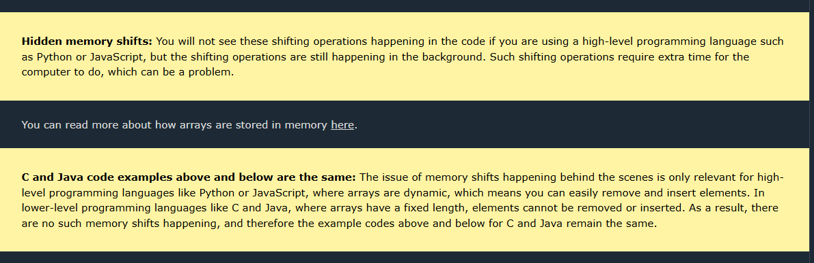

# Types of Sorting in DSA

#### Comparison Baesd

Bubble    Sort\
Selection Sort\
Insertion Sort\
Quick     sort\
Merge     Sort\
Heap      Sort\

#### Non-Comparison Baesd

Counting Sort\
Radix    Sort\
Bucket   Sort\
Shell    Sort


| Topic                        | Description                                                                                   | Example/Key Points                                                                                   |
|------------------------------|-----------------------------------------------------------------------------------------------|------------------------------------------------------------------------------------------------------|
| **Sorting Algorithms**       | Arranging data in a particular order (ascending/descending).                                  | Bubble, Selection, Insertion, Quick, Merge, Heap, Counting, Radix, Bucket, Shell                     |
| Bubble Sort                  | Repeatedly swaps adjacent elements if they are in wrong order.                                | Simple, O(n²), stable, best O(n)                                                                     |
| Selection Sort               | Selects minimum and swaps with front.                                                         | O(n²), not stable, few swaps                                                                         |
| Insertion Sort               | Builds sorted array one element at a time.                                                    | O(n²), stable, adaptive, best O(n)                                                                   |
| Quick Sort                   | Divide and conquer, uses pivot to partition.                                                  | O(n log n) avg, O(n²) worst, not stable                                                              |
| Merge Sort                   | Divide and conquer, merges sorted halves.                                                     | O(n log n), stable, good for linked lists                                                            |
| Heap Sort                    | Uses heap data structure to sort.                                                             | O(n log n), not stable, in-place                                                                     |
| Counting Sort                | Counts occurrences, only for integers in small range.                                         | O(n + k), stable, non-comparison                                                                     |
| Radix Sort                   | Sorts by digit, uses stable sort as subroutine.                                               | O(nk), stable, non-comparison                                                                        |
| Bucket Sort                  | Distributes into buckets, sorts each, merges.                                                 | O(n + k), stable, for uniformly distributed data                                                     |
| Shell Sort                   | Generalized insertion sort with gaps.                                                         | O(n log n) best, O(n²) worst, not stable                                                             |
| **Linked List**              | Linear data structure with nodes pointing to next (and/or previous) node.                     | Singly, Doubly, Circular, Circular Doubly                                                            |
| Singly Linked List           | Each node points to next node.                                                                | Traverse, insert, delete                                                                             |
| Doubly Linked List           | Each node points to next and previous node.                                                   | Traverse forward/backward, insert, delete                                                            |
| Circular Linked List         | Last node points to first node.                                                               | Useful for round-robin, buffer management                                                            |
| Circular Doubly Linked List  | Doubly linked and circular.                                                                   | Traverse in both directions, circular                                                                |
| **Stack**                    | LIFO (Last In First Out) data structure.                                                      | push, pop, peek, isEmpty, size                                                                       |
| Stack (Array)                | Stack implemented using array/list.                                                           | Simple, fast, fixed size                                                                             |
| Stack (Linked List)          | Stack implemented using linked list.                                                          | Dynamic size, no overflow                                                                            |
| **Queue**                    | FIFO (First In First Out) data structure.                                                     | enqueue, dequeue, front, isEmpty, size                                                               |
| Queue (Array)                | Queue using array/list.                                                                       | Simple, but shifting needed                                                                          |
| Queue (Linked List)          | Queue using linked list.                                                                      | Efficient enqueue/dequeue                                                                            |
| Circular Queue               | Queue wraps around to use space efficiently.                                                  | Used in buffering, scheduling                                                                        |
| Priority Queue               | Each element has priority, served based on priority.                                          | Implemented with heap                                                                                |
| **Tree**                     | Hierarchical data structure with nodes.                                                       | Binary Tree, BST, AVL, Heap, B-Tree                                                                  |
| Binary Tree                  | Each node has at most two children.                                                           | Traversals: inorder, preorder, postorder                                                             |
| Binary Search Tree (BST)     | Binary tree with left < root < right property.                                                | Fast search, insert, delete                                                                          |
| AVL Tree                     | Self-balancing BST.                                                                           | Rotations to maintain balance                                                                        |
| Heap                         | Complete binary tree, max/min at root.                                                        | Used in heap sort, priority queue                                                                    |
| B-Tree                       | Generalized BST for databases, file systems.                                                  | Multi-way, balanced                                                                                  |
| Trie                         | Prefix tree for strings/words.                                                                | Fast search, autocomplete                                                                            |
| **Graph**                    | Set of nodes (vertices) connected by edges.                                                   | Directed/Undirected, Weighted/Unweighted, Cyclic/Acyclic                                             |
| Graph Representation         | Ways to store graphs.                                                                         | Adjacency matrix, adjacency list                                                                     |
| Graph Traversal              | Visiting all nodes/edges.                                                                     | BFS (Breadth-First Search), DFS (Depth-First Search)                                                 |
| Shortest Path Algorithms     | Find shortest path between nodes.                                                             | Dijkstra, Bellman-Ford, Floyd-Warshall                                                               |
| Minimum Spanning Tree        | Connect all nodes with minimum total edge weight.                                             | Kruskal, Prim                                                                                        |
| Topological Sort             | Linear ordering of DAG nodes.                                                                 | Used in scheduling                                                                                   |
| **Hashing**                  | Mapping data to fixed-size values (hash codes).                                               | Hash tables, hash maps, collision resolution (chaining, open addressing)                             |
| **Recursion**                | Function calls itself to solve subproblems.                                                   | Used in divide and conquer, tree/graph traversals                                                    |
| **Dynamic Programming**      | Solving problems by breaking into overlapping subproblems and storing results.                | Memoization, tabulation, examples: Fibonacci, knapsack, LIS                                          |
| **Greedy Algorithms**        | Make locally optimal choices at each step.                                                    | Activity selection, coin change, Huffman coding                                                      |
| **Divide and Conquer**       | Divide problem into subproblems, solve recursively, combine results.                          | Merge sort, quick sort, binary search                                                                |
| **Backtracking**             | Try all possibilities, backtrack on failure.                                                  | N-Queens, Sudoku, permutations/combinations                                                          |
| **Bit Manipulation**         | Algorithms using bitwise operations.                                                          | Set/clear/toggle bits, count set bits, bit masks                                                     |
| **Searching Algorithms**     | Find element in data structure.                                                               | Linear search, binary search                                                                         |
| **Mathematical Algorithms**  | Algorithms for mathematical problems.                                                         | GCD, LCM, prime check, sieve of Eratosthenes                                                         |
| **String Algorithms**        | Algorithms for string processing.                                                             | Pattern matching (KMP, Rabin-Karp), palindrome, anagrams, substring search                           |
| **Miscellaneous**            | Other important DSA topics.                                                                   | Union-Find (Disjoint Set), Segment Tree, Fenwick Tree (Binary Indexed Tree), LRU Cache, etc.         |

### Ref

>https://www.programiz.com/dsa/sorting-algorithm

>https://www.w3schools.com/dsa/dsa_algo_selectionsort.php


# Bubble Sort

>Bubble Sort is an algorithm that sorts an array from the lowest value to the highest value.

Example Bubble Sort :-
```python
	my_array = [64, 34, 25, 12, 22, 11, 90, 5]

	n = len(my_array)
	for i in range(n-1):
		for j in range(n-i-1):
			if my_array[j] > my_array[j+1]:
				my_array[j], my_array[j+1] = my_array[j+1], my_array[j]

	print("Sorted array:", my_array)
```	
---------------------------------------------------------------------------------------------------------------------	
```python	
Bubble sort Improvment :-  my_array = [7, 3, 9, 12, 11]

        my_array = [7, 3, 9, 12, 11]

        n = len(my_array)
        for i in range(n-1):
            swapped = False
            for j in range(n-i-1):
                if my_array[j] > my_array[j+1]:
                    my_array[j], my_array[j+1] = my_array[j+1], my_array[j]
                    swapped = True
            if not swapped:
                break

        print("Sorted array:", my_array)
```
------------------------------------------------------------------------------------------------------------------	
	
### Bubble Sort Time Complexity :-

The Bubble Sort algorithm loops through every value in the array, comparing it to the value next to it. So for an array of 
n values, there must be n such comparisons in one loop. And after one loop, the array is looped through again and again n times.

>This means there are n * n comparisons done in total, so the time complexity for Bubble Sort is: ***O(n2)***
	


### The best-case time complexity of Bubble Sort is : O(n)

In the best case, the array is already sorted. Bubble Sort includes a mechanism to detect this by checking if any swaps were made during a pass. If no swaps occur, the algorithm terminates early.

Pass 1: Compares adjacent elements but makes no swaps.
Early exit: Since no swaps were made, the algorithm concludes the array is sorted.
This results in only one pass through the array, hence linear time complexity.

### The worst-case time complexity of Bubble Sort is : O(n²)

In the worst case, the array is sorted in reverse order. Bubble Sort will:

Perform n−1 passes through the array.
On each pass, it compares and swaps adjacent elements to "bubble" the largest unsorted element to its correct position.
Each pass involves up to n−i comparisons (where i is the pass number).


# Selection Sort

>The Selection Sort algorithm finds the lowest value in an array and moves it to the front of the array.


Example Selection Sort :-
```python
    my_array = [64, 34, 25, 5, 22, 11, 90, 12]

    n = len(my_array)
    for i in range(n-1):
        min_index = i
        for j in range(i+1, n):
            if my_array[j] < my_array[min_index]:
                min_index = j
        min_value = my_array.pop(min_index)
        my_array.insert(i, min_value)

    print("Sorted array:", my_array)
```

### Selection Sort Shifting Problem

The Selection Sort algorithm can be improved a little bit more.

In the code above, the lowest value element is removed, and then inserted in front of the array.

Each time the next lowest value array element is removed, all following elements must be shifted one place down to make up for the removal.


These shifting operation takes a lot of time, and we are not even done yet! After the lowest value (5) is found and removed, it is inserted at the start of the array, causing all following values to shift one position up to make space for the new value, like the image below shows.


 >Solution: Swap Values!

Instead of all the shifting, swap the lowest value (5) with the first value (64) like below.


 >Here is an implementation of the improved Selection Sort, using swapping:
```python
    my_array = [64, 34, 25, 12, 22, 11, 90, 5]

    n = len(my_array)
    for i in range(n):
        min_index = i
        for j in range(i+1, n):
            if my_array[j] < my_array[min_index]:
                min_index = j   
        my_array[i], my_array[min_index] = my_array[min_index], my_array[i]

    print("Sorted array:", my_array)
```

 ### Selection Sort Time Complexity

Selection Sort sorts an array of n values.

On average, about n / 2 elements are compared to find the lowest value in each loop.

And Selection Sort must run the loop to find the lowest value approximately n times.

We get time complexity:


>The most significant difference from Bubble sort that we can notice in this simulation is that best and worst case is actually almost the same for Selection Sort ***(O(n2))***, but for Bubble Sort the best case runtime is only ***O(n)***.


# Insertion Sort

>The Insertion Sort algorithm uses one part of the array to hold the sorted values, and the other part of the array to hold values that are not sorted yet.

Example Insertion Sort :-
```python
    my_array = [64, 34, 25, 12, 22, 11, 90, 5]

    n = len(my_array)
    for i in range(1,n):
        insert_index = i
        current_value = my_array.pop(i)
        for j in range(i-1, -1, -1):
            if my_array[j] > current_value:
                insert_index = j
        my_array.insert(insert_index, current_value)

    print("Sorted array:", my_array)
```

 ## Insertion Sort Improvement




### ***Imporoved Solution Only Applicable for High level Programming languages like python and java script***


```python
    my_array = [64, 34, 25, 12, 22, 11, 90, 5]

    n = len(my_array)
    for i in range(1,n):
        insert_index = i
        current_value = my_array[i]
        for j in range(i-1, -1, -1):
            if my_array[j] > current_value:
                my_array[j+1] = my_array[j]
                insert_index = j
            else:
                break
        my_array[insert_index] = current_value

    print("Sorted array:", my_array)
```
> ***JAVA CODE REMAIN SAME***

```Java
    public class Main {
        public static void main(String[] args) {
            int[] myArray = {64, 34, 25, 12, 22, 11, 90, 5};

            int n = myArray.length;
            for (int i = 1; i < n; i++) {
                int insertIndex = i;
                int currentValue = myArray[i];
                int j = i - 1;

                while (j >= 0 && myArray[j] > currentValue) {
                    myArray[j + 1] = myArray[j];
                    insertIndex = j;
                    j--;
                }
                myArray[insertIndex] = currentValue;
            }

            System.out.print("Sorted array: ");
            for (int value : myArray) {
                System.out.print(value + " ");
            }
        }
    }

    //Java
```
## Insertion Sort Time Complexity


# Quicksort

> As the name suggests, Quicksort is one of the fastest sorting algorithms.
The Quicksort algorithm takes an array of values, chooses one of the values as the 'pivot' element, and moves the other values so that lower values are on the left of the pivot element, and higher values are on the right of it.

To implement the Quicksort algorithm in a programming language, we need:

1. An array with values to sort.
2. A quickSort method that calls itself (recursion) if the sub-array has a size larger than 1.
3. A partition method that receives a sub-array, moves values around, swaps the pivot element into the sub-array and returns the index where the next split in sub-arrays happens.

```python
    def partition(array, low, high):
        pivot = array[high]
        i = low - 1

        for j in range(low, high):
            if array[j] <= pivot:
                i += 1
                array[i], array[j] = array[j], array[i]

        array[i+1], array[high] = array[high], array[i+1]
        return i+1

    def quicksort(array, low=0, high=None):
        if high is None:
            high = len(array) - 1

        if low < high:
            pivot_index = partition(array, low, high)
            quicksort(array, low, pivot_index-1)
            quicksort(array, pivot_index+1, high)

    my_array = [64, 34, 25, 12, 22, 11, 90, 5]
    quicksort(my_array)
    print("Sorted array:", my_array)
```
>***Java Code***

```Java
public class Main {
    public static void main(String[] args) {
        int[] myArray = {64, 34, 25, 12, 22, 11, 90, 5};
        quicksort(myArray, 0, myArray.length - 1);

        System.out.print("Sorted array: ");
        for (int value : myArray) {
            System.out.print(value + " ");
        }
    }

    public static void quicksort(int[] array, int low, int high) {
        if (low < high) {
            int pivotIndex = partition(array, low, high);
            quicksort(array, low, pivotIndex - 1);
            quicksort(array, pivotIndex + 1, high);
        }
    }

    public static int partition(int[] array, int low, int high) {
        int pivot = array[high];
        int i = low - 1;

        for (int j = low; j < high; j++) {
            if (array[j] <= pivot) {
                i++;
                int temp = array[i];
                array[i] = array[j];
                array[j] = temp;
            }
        }

        int temp = array[i + 1];
        array[i + 1] = array[high];
        array[high] = temp;
        return i + 1;
    }
}

//Java
```

### Quicksort Time Complexity


# Counting Sort

>The Counting Sort algorithm sorts an array by counting the number of times each value occurs.

Run the simulation to see how 17 integer values from 1 till 5 are sorted using Counting Sort.

Counting Sort does not compare values like the previous sorting algorithms we have looked at, and only works on non-negative integers.

Furthermore, Counting Sort is fast when the range of possible values \( k \) is smaller than the number of values \( n \).


Example of Counting Sort :-

```python
def countingSort(arr):
    max_val = max(arr)
    count = [0] * (max_val + 1)

    while len(arr) > 0:
        num = arr.pop(0)
        count[num] += 1

    for i in range(len(count)):
        while count[i] > 0:
            arr.append(i)
            count[i] -= 1

    return arr

unsortedArr = [4, 2, 2, 6, 3, 3, 1, 6, 5, 2, 3]
sortedArr = countingSort(unsortedArr)
print("Sorted array:", sortedArr)
```

### Counting Sort Implementation
To implement the Counting Sort algorithm in a programming language, we need:

1. An array with values to sort.
2. A 'countingSort' method that receives an array of integers.
3. An array inside the method to keep count of the values.
4. A loop inside the method that counts and removes values, by incrementing elements in the counting array.
5. A loop inside the method that recreates the array by using the counting array, so that the elements appear in the right order.

One more thing: We need to find out what the highest value in the array is, so that the counting array can be created with the correct size. For example, if the highest value is 5, the counting array must be 6 elements in total, to be able count all possible non negative integers 0, 1, 2, 3, 4 and 5.

Here, **n** is the number of elements in the array to be sorted, and **k** is the range of possible values in the array (specifically, the maximum value in the array plus one if starting from zero).

- **n** = number of items to sort (array length)
- **k** = range of input values (max value - min value + 1)

**Example:**  
If you have the array `[2, 5, 3, 2, 8]`,  
- n = 5 (five elements)
- k = 8 + 1 = 9 (values range from 0 to 8, so k = 9)

Counting Sort is efficient when **k** is not much larger than **n**.

### Time Complexity


# Radix Sort

> The Radix Sort algorithm sorts an array by individual digits, starting with the least significant digit (the rightmost one).

## How Radix Sort Works

Radix Sort processes each digit of the numbers, one digit at a time, from the least significant digit (LSD) to the most significant digit (MSD). It uses a stable sub-sorting algorithm (often Counting Sort) to sort the numbers based on each digit.

### Steps:
1. Find the maximum number to know the number of digits.
2. Starting from the least significant digit, sort the array using a stable sort (like Counting Sort) according to the current digit.
3. Repeat the process for each digit, moving towards the most significant digit.

### Example

Suppose we have the array: `[170, 45, 75, 90, 802, 24, 2, 66]`

- **Step 1:** Sort by units place (1s digit):  
  `[170, 90, 802, 2, 24, 45, 75, 66]`
- **Step 2:** Sort by tens place (10s digit):  
  `[802, 2, 24, 45, 66, 170, 75, 90]`
- **Step 3:** Sort by hundreds place (100s digit):  
  `[2, 24, 45, 66, 75, 90, 170, 802]`

Now the array is sorted.

### Time Complexity

- **O(nk)**, where n is the number of elements and k is the number of digits in the largest number.

### When to Use

- Efficient for sorting large lists of integers or strings with a fixed length.
- Not comparison-based, so it can be faster than comparison sorts for certain data.

### Python Example

```python
def counting_sort(arr, exp):
    n = len(arr)
    output = [0] * n
    count = [0] * 10

    for i in range(n):
        index = (arr[i] // exp) % 10
        count[index] += 1

    for i in range(1, 10):
        count[i] += count[i - 1]

    i = n - 1
    while i >= 0:
        index = (arr[i] // exp) % 10
        output[count[index] - 1] = arr[i]
        count[index] -= 1
        i -= 1

    for i in range(n):
        arr[i] = output[i]

def radix_sort(arr):
    max_num = max(arr)
    exp = 1
    while max_num // exp > 0:
        counting_sort(arr, exp)
        exp *= 10

arr = [170, 45, 75, 90, 802, 24, 2, 66]
radix_sort(arr)
print("Sorted array:", arr)
```

```python
def bubbleSort(arr):
    n = len(arr)
    for i in range(n):
        for j in range(0, n - i - 1):
            if arr[j] > arr[j + 1]:
                arr[j], arr[j + 1] = arr[j + 1], arr[j]
                
def radixSortWithBubbleSort(arr):
    max_val = max(arr)
    exp = 1
    
    while max_val // exp > 0:
        radixArray = [[],[],[],[],[],[],[],[],[],[]]
        
        for num in arr:
            radixIndex = (num // exp) % 10
            radixArray[radixIndex].append(num)
        
        for bucket in radixArray:
            bubbleSort(bucket)
        
        i = 0
        for bucket in radixArray:
            for num in bucket:
                arr[i] = num
                i += 1
        
        exp *= 10

myArray = [170, 45, 75, 90, 802, 24, 2, 66]
print("Original array:", myArray)
radixSortWithBubbleSort(myArray)
print("Sorted array:", myArray)
```

## Radix Sort Time Complexity


# Merge Sort


## Difference Between All Types of Sorting Algorithms

Sorting algorithms can be broadly classified into **Comparison-Based** and **Non-Comparison-Based** sorts. Here’s a brief discussion of each, with examples:

---

### 1. Bubble Sort
- **Type:** Comparison-Based
- **How it works:** Repeatedly steps through the list, compares adjacent elements, and swaps them if they are in the wrong order. This process is repeated until the list is sorted.
- **Example:**  
  `[5, 3, 8, 4]` → `[3, 5, 4, 8]` → `[3, 4, 5, 8]`
- **Time Complexity:** Best O(n), Worst O(n²)
- **Use Case:** Simple, educational, not used for large datasets.

---

### 2. Selection Sort
- **Type:** Comparison-Based
- **How it works:** Finds the minimum element from the unsorted part and puts it at the beginning. Repeats for all positions.
- **Example:**  
  `[5, 3, 8, 4]` → `[3, 5, 8, 4]` → `[3, 4, 8, 5]` → `[3, 4, 5, 8]`
- **Time Complexity:** O(n²) for all cases
- **Use Case:** When memory writes are costly.

---

### 3. Insertion Sort
- **Type:** Comparison-Based
- **How it works:** Builds the sorted array one item at a time by inserting each element into its correct position.
- **Example:**  
  `[5, 3, 8, 4]` → `[3, 5, 8, 4]` → `[3, 5, 8, 4]` → `[3, 4, 5, 8]`
- **Time Complexity:** Best O(n), Worst O(n²)
- **Use Case:** Efficient for small or nearly sorted arrays.

---

### 4. Quick Sort
- **Type:** Comparison-Based, Divide and Conquer
- **How it works:** Picks a 'pivot' element, partitions the array into two sub-arrays (less than and greater than pivot), and recursively sorts them.
- **Example:**  
  `[5, 3, 8, 4]` (pivot 4) → `[3] [4] [5, 8]` → `[3, 4, 5, 8]`
- **Time Complexity:** Best/Average O(n log n), Worst O(n²)
- **Use Case:** General-purpose, fast for large datasets.

---

### 5. Merge Sort
- **Type:** Comparison-Based, Divide and Conquer
- **How it works:** Divides the array into halves, sorts each half, and merges them back together.
- **Example:**  
  `[5, 3, 8, 4]` → `[5, 3] [8, 4]` → `[3, 5] [4, 8]` → `[3, 4, 5, 8]`
- **Time Complexity:** O(n log n) for all cases
- **Use Case:** Stable sort, good for linked lists and large datasets.

---

### 6. Heap Sort
- **Type:** Comparison-Based
- **How it works:** Converts the array into a heap, repeatedly extracts the maximum element, and rebuilds the heap.
- **Example:**  
  `[5, 3, 8, 4]` → build max heap `[8, 5, 3, 4]` → extract max and rebuild
- **Time Complexity:** O(n log n)
- **Use Case:** When constant space is needed (in-place sort).

---

### 7. Counting Sort
- **Type:** Non-Comparison-Based
- **How it works:** Counts the number of occurrences of each value, then calculates positions.
- **Example:**  
  `[4, 2, 2, 8, 3, 3, 1]` → count occurrences → build sorted array
- **Time Complexity:** O(n + k), where k is the range of input
- **Use Case:** Only for integers in a small range.

---

### 8. Radix Sort
- **Type:** Non-Comparison-Based
- **How it works:** Sorts numbers digit by digit, starting from least significant digit.
- **Example:**  
  `[170, 45, 75, 90, 802, 24, 2, 66]` → sort by units, then tens, then hundreds
- **Time Complexity:** O(nk), where k is the number of digits
- **Use Case:** Large lists of integers or strings.

---

### 9. Bucket Sort
- **Type:** Non-Comparison-Based
- **How it works:** Distributes elements into buckets, sorts each bucket, and concatenates them.
- **Example:**  
  `[0.42, 4.21, 0.33, 0.52, 0.25]` → distribute into buckets → sort buckets → merge
- **Time Complexity:** O(n + k)
- **Use Case:** Uniformly distributed floating-point numbers.

---

### 10. Shell Sort
- **Type:** Comparison-Based
- **How it works:** Generalization of insertion sort that allows the exchange of items far apart by sorting elements at specific intervals (gaps).
- **Example:**  
  `[5, 3, 8, 4]` → gap 2: compare and swap → gap 1: insertion sort
- **Time Complexity:** Best O(n log n), Worst O(n²)
- **Use Case:** In-place, better than insertion sort for medium-sized arrays.

---

## Summary Table

| Algorithm      | Type           | Best      | Average   | Worst     | Stable | Use Case/Notes                       |
|----------------|---------------|-----------|-----------|-----------|--------|--------------------------------------|
| Bubble Sort    | Comparison    | O(n)      | O(n²)     | O(n²)     | Yes    | Simple, educational                  |
| Selection Sort | Comparison    | O(n²)     | O(n²)     | O(n²)     | No     | Few swaps, not adaptive              |
| Insertion Sort | Comparison    | O(n)      | O(n²)     | O(n²)     | Yes    | Good for small/nearly sorted arrays  |
| Quick Sort     | Comparison    | O(n log n)| O(n log n)| O(n²)     | No     | Fast, general-purpose                |
| Merge Sort     | Comparison    | O(n log n)| O(n log n)| O(n log n)| Yes    | Stable, good for linked lists        |
| Heap Sort      | Comparison    | O(n log n)| O(n log n)| O(n log n)| No     | In-place, not stable                 |
| Counting Sort  | Non-Comp      | O(n + k)  | O(n + k)  | O(n + k)  | Yes    | Only for small integer ranges        |
| Radix Sort     | Non-Comp      | O(nk)     | O(nk)     | O(nk)     | Yes    | Integers/strings, non-comparison     |
| Bucket Sort    | Non-Comp      | O(n + k)  | O(n + k)  | O(n²)     | Yes    | Uniformly distributed data           |
| Shell Sort     | Comparison    | O(n log n)| O(n^1.5)  | O(n²)     | No     | In-place, better than insertion sort |

---


## Difference Between Selection Sort and Insertion Sort

**Selection Sort** and **Insertion Sort** are both simple, comparison-based sorting algorithms, but they work differently:

### Selection Sort
- **How it works:** Repeatedly finds the minimum element from the unsorted part and puts it at the beginning.
- **Number of swaps:** Performs at most n swaps (one per pass).
- **Number of comparisons:** Always makes O(n²) comparisons, regardless of the initial order.
- **Best, Average, Worst Case:** All are O(n²).
- **Stability:** Not stable by default.
- **When to use:** Useful when the cost of swapping is high and the number of swaps needs to be minimized.

### Insertion Sort
- **How it works:** Builds the sorted array one element at a time by inserting each new element into its correct position in the already sorted part.
- **Number of swaps/shifts:** Can require many shifts, especially if the array is in reverse order.
- **Number of comparisons:** O(n) in the best case (already sorted), O(n²) in the worst case.
- **Best Case:** O(n) (when the array is already sorted).
- **Average/Worst Case:** O(n²).
- **Stability:** Stable.
- **When to use:** Efficient for small or nearly sorted arrays.

**Summary Table:**

| Feature            | Selection Sort         | Insertion Sort         |
|--------------------|-----------------------|------------------------|
| Approach           | Select min, swap       | Insert in place        |
| Comparisons        | O(n²)                  | O(n) best, O(n²) worst |
| Swaps/Shifts       | O(n) swaps             | O(n²) shifts           |
| Stability          | Not stable             | Stable                 |
| Best Case          | O(n²)                  | O(n)                   |
| Adaptive           | No                     | Yes                    |


# Linked List


```python
class Node:
    def __init__(self, data):
        self.data = data
        self.next = None
    
node1 = Node(3)
node2 = Node(5)
node3 = Node(13)
node4 = Node(2)

node1.next = node2
node2.next = node3
node3.next = node4

currentNode = node1
while currentNode:
    print(currentNode.data, end=" -> ")
    currentNode = currentNode.next
print("null")

#Python
```


## Types of Linked Lists
### There are three basic forms of linked lists:

> Singly linked lists  
> Doubly linked lists \
> Circular linked lists


# Linked List Implementations

### 1. Singly Linked List Implementation

```python
class Node:
    def __init__(self, data):
        self.data = data
        self.next = None
    
node1 = Node(3)
node2 = Node(5)
node3 = Node(13)
node4 = Node(2)

node1.next = node2
node2.next = node3
node3.next = node4

currentNode = node1
while currentNode:
    print(currentNode.data, end=" -> ")
    currentNode = currentNode.next
print("null")
```

### 2. Doubly Linked List Implementation

```python
class Node:
    def __init__(self, data):
        self.data = data
        self.next = None
        self.prev = None
    
node1 = Node(3)
node2 = Node(5)
node3 = Node(13)
node4 = Node(2)

node1.next = node2

node2.prev = node1
node2.next = node3

node3.prev = node2
node3.next = node4

node4.prev = node3

print("\nTraversing forward:")
currentNode = node1
while currentNode:
    print(currentNode.data, end=" -> ")
    currentNode = currentNode.next
print("null")

print("\nTraversing backward:")
currentNode = node4
while currentNode:
    print(currentNode.data, end=" -> ")
    currentNode = currentNode.prev
print("null")
```

### 3. Circular Singly Linked List Implementation

```python
class Node:
    def __init__(self, data):
        self.data = data
        self.next = None
    
node1 = Node(3)
node2 = Node(5)
node3 = Node(13)
node4 = Node(2)

node1.next = node2
node2.next = node3
node3.next = node4
node4.next = node1

currentNode = node1
startNode = node1
print(currentNode.data, end=" -> ") 
currentNode = currentNode.next 

while currentNode != startNode:
    print(currentNode.data, end=" -> ")
    currentNode = currentNode.next

print("...")

Line 14: This makes the singly list circular.

Line 17: This is how the program knows when to stop so that it only goes through the list one time.

```


### 4. Circular Doubly Linked List Implementation


```python
class Node:
    def __init__(self, data):
        self.data = data
        self.next = None
        self.prev = None

node1 = Node(3)
node2 = Node(5)
node3 = Node(13)
node4 = Node(2)

node1.next = node2
node1.prev = node4

node2.prev = node1
node2.next = node3

node3.prev = node2
node3.next = node4

node4.prev = node3
node4.next = node1

print("\nTraversing forward:")
currentNode = node1
startNode = node1
print(currentNode.data, end=" -> ")
currentNode = currentNode.next

while currentNode != startNode:
    print(currentNode.data, end=" -> ")
    currentNode = currentNode.next
print("...")

print("\nTraversing backward:")
currentNode = node4
startNode = node4
print(currentNode.data, end=" -> ")
currentNode = currentNode.prev

while currentNode != startNode:
    print(currentNode.data, end=" -> ")
    currentNode = currentNode.prev
print("...")

Lines 13 and 22: These links makes the doubly linked list circular.

Lines 26: This is how the program knows when to stop so that it only goes through the list one time.

```


### Linked List Operations

>***All done on singularly linked list***

>Traverse (or search), and delete python logic

```python
class Node:
    def __init__(self, data):
        self.data = data
        self.next = None

def traverseAndPrint(head):
    currentNode = head
    while currentNode:
        print(currentNode.data, end=" -> ")
        currentNode = currentNode.next
    print("null")

def deleteSpecificNode(head, nodeToDelete):

    if head == nodeToDelete:
        return head.next

    currentNode = head
    while currentNode.next and currentNode.next != nodeToDelete:
        currentNode = currentNode.next

    if currentNode.next is None:
        return head

    currentNode.next = currentNode.next.next

    return head

node1 = Node(7)
node2 = Node(11)
node3 = Node(3)
node4 = Node(2)
node5 = Node(9)

node1.next = node2
node2.next = node3
node3.next = node4
node4.next = node5

print("Before deletion:")
traverseAndPrint(node1)

# Delete node4
node1 = deleteSpecificNode(node1, node4)

print("\nAfter deletion:")
traverseAndPrint(node1)

```
> Insert into linked list 

```python
def insertNodeAtPosition(head, newNode, position):
    if position == 1:
        newNode.next = head
        return newNode
    
    currentNode = head
    for _ in range(position - 2):
        if currentNode is None:
            break
        currentNode = currentNode.next

    newNode.next = currentNode.next
    currentNode.next = newNode
    return head

```


# Stacks

>LIFO: Last In First Out.

### Basic operations we can do on a stack are:

1. **Push:** Adds a new element on the stack.  
2. **Pop:** Removes and returns the top element from the stack.  
3. **Peek:** Returns the top element on the stack.  
4. **isEmpty:** Checks if the stack is empty.  
5. **Size:** Finds the number of elements in the stack.

>Stacks can be implemented by using arrays or linked lists.

>Stacks can be used to implement undo mechanisms, to revert to previous states, to create algorithms for depth-first search in graphs, or for backtracking.

>Stacks are often mentioned together with Queues, which is a similar data structure described on the next page.

### Stack implementaton using Array
```python
class Stack:
    def __init__(self):
        self.stack = []
    
    def push(self, element):
        self.stack.append(element)
    
    def pop(self):
        if self.isEmpty():
            return "Stack is empty"
        return self.stack.pop()
    
    def peek(self):
        if self.isEmpty():
            return "Stack is empty"
        return self.stack[-1]
    
    def isEmpty(self):
        return len(self.stack) == 0
    
    def size(self):
        return len(self.stack)

# Create a stack
myStack = Stack()

myStack.push('A')
myStack.push('B')
myStack.push('C')
print("Stack: ", myStack.stack)

print("Pop: ", myStack.pop())

print("Peek: ", myStack.peek())

print("isEmpty: ", myStack.isEmpty())

print("Size: ", myStack.size())

```

### Stack implementaton using Linked List

```python
class Node:
    def __init__(self, value):
        self.value = value
        self.next = None

class Stack:
    def __init__(self):
        self.head = None
        self.size = 0
    
    def push(self, value):
        new_node = Node(value)
        if self.head:
            new_node.next = self.head
        self.head = new_node
        self.size += 1
    
    def pop(self):
        if self.isEmpty():
            return "Stack is empty"
        popped_node = self.head
        self.head = self.head.next
        self.size -= 1
        return popped_node.value
    
    def peek(self):
        if self.isEmpty():
            return "Stack is empty"
        return self.head.value
    
    def isEmpty(self):
        return self.size == 0
    
    def stackSize(self):
        return self.size

# Usage
myStack = Stack()
myStack.push('A')
myStack.push('B')
myStack.push('C')

print("Pop: ", myStack.pop())
print("Peek: ", myStack.peek())
print("isEmpty: ", myStack.isEmpty())
print("Size: ", myStack.stackSize())

#Python

```

# Queues
>A queue is a data structure that can hold many elements.
>The first person to stand in line is also the first who can pay and leave the supermarket. This way of organizing elements is called FIFO: First In First Out.


### 

Basic operations we can do on a queue are:

1. **Enqueue:** Adds a new element to the queue.  
2. **Dequeue:** Removes and returns the first (front) element from the queue.  
3. **Peek:** Returns the first element in the queue.  
4. **isEmpty:** Checks if the queue is empty.  
5. **Size:** Finds the number of elements in the queue.

>Queues can be implemented by using arrays or linked lists.

>Queues can be used to implement job scheduling for an office printer, order processing for e-tickets, or to create algorithms for breadth-first search in graphs.

### Queue Implementation using Arrays

```python
class Queue:
    def __init__(self):
        self.queue = []
    
    def enqueue(self, element):
        self.queue.append(element)
    
    def dequeue(self):
        if self.isEmpty():
            return "Queue is empty"
        return self.queue.pop(0)
    
    def peek(self):
        if self.isEmpty():
            return "Queue is empty"
        return self.queue[0]
    
    def isEmpty(self):
        return len(self.queue) == 0
    
    def size(self):
        return len(self.queue)

# Create a queue
myQueue = Queue()

myQueue.enqueue('A')
myQueue.enqueue('B')
myQueue.enqueue('C')
print("Queue: ", myQueue.queue)

print("Dequeue: ", myQueue.dequeue())

print("Peek: ", myQueue.peek())

print("isEmpty: ", myQueue.isEmpty())

print("Size: ", myQueue.size())

```

### Queue Implementation using Linked Lists

```python
class Node:
    def __init__(self, data):
        self.data = data
        self.next = None

class Queue:
    def __init__(self):
        self.front = None
        self.rear = None
        self.length = 0
    
    def enqueue(self, element):
        new_node = Node(element)
        if self.rear is None:
            self.front = self.rear = new_node
            self.length += 1
            return
        self.rear.next = new_node
        self.rear = new_node
        self.length += 1
    
    def dequeue(self):
        if self.isEmpty():
            return "Queue is empty"
        temp = self.front
        self.front = temp.next
        self.length -= 1
        if self.front is None:
            self.rear = None
        return temp.data
    
    def peek(self):
        if self.isEmpty():
            return "Queue is empty"
        return self.front.data
    
    def isEmpty(self):
        return self.length == 0
    
    def size(self):
        return self.length

    def printQueue(self):
        temp = self.front
        while temp:
            print(temp.data, end=" ")
            temp = temp.next
        print()

# Create a queue
myQueue = Queue()

myQueue.enqueue('A')
myQueue.enqueue('B')
myQueue.enqueue('C')
print("Queue: ", end="")
myQueue.printQueue()

print("Dequeue: ", myQueue.dequeue())

print("Peek: ", myQueue.peek())

print("isEmpty: ", myQueue.isEmpty())

print("Size: ", myQueue.size())
```

# Hash Tables

>A Hash Table is a data structure designed to be fast to work with.
The reason Hash Tables are sometimes preferred instead of arrays or linked lists is because searching for, adding, and deleting data can be done really quickly, even for large amounts of data.


***The character "B" has Unicode code point 66, "o" has 111, and "b" has 98. Adding those together we get 275. Modulo 10 of 275 is 5, so "Bob" should be stored as an array element at index 5.***

***The number returned by the hash function is called the hash code.***

```python
my_hash_set = [None,'Jones',None,'Lisa',None,'Bob',None,'Siri','Pete',None]

def hash_function(value):
    sum_of_chars = 0
    for char in value:
        sum_of_chars += ord(char)

    return sum_of_chars % 10
    
def contains(name):
    index = hash_function(name)
    return my_hash_set[index] == name

print("'Pete' is in the Hash Set:",contains('Pete'))
```

>When ***deleting*** a name from our Hash Set, we can also use the hash function to go straight to where the name is, and set that element value to ***None***.

### Handling Collisions

>Let's also add "Stuart" to our Hash Set.
We give "Stuart" to our hash function, and we get the hash code 3, meaning "Stuart" should be stored at index 3.
Trying to store "Stuart" creates what is called a collision, because "Lisa" is already stored at index 3.

>To fix the collision, we can make room for more elements in the same bucket, and solving the collision problem in this way is called chaining. We can give room for more elements in the same bucket by implementing each bucket as a ***linked list, or as an array***.

```python
my_hash_set = [
    [None],
    ['Jones'],
    [None],
    ['Lisa', 'Stuart'],
    [None],
    ['Bob'],
    [None],
    ['Siri'],
    ['Pete'],
    [None]
]
```


### Hash Set code example and simulation

>To complete our very basic Hash Set code, let's have functions for adding and searching for names in the Hash Set, which is now a two dimensional array.

Run the code example below, and try it with different values to get a better understanding of how a Hash Set works.

```python
my_hash_set = [
    [None],
    ['Jones'],
    [None],
    ['Lisa'],
    [None],
    ['Bob'],
    [None],
    ['Siri'],
    ['Pete'],
    [None]
]

def hash_function(value):
    return sum(ord(char) for char in value) % 10
    
def add(value):
    index = hash_function(value)
    bucket = my_hash_set[index]
    if value not in bucket:
        bucket.append(value)
        
def contains(value):
    index = hash_function(value)
    bucket = my_hash_set[index]
    return value in bucket

add('Stuart')

print(my_hash_set)
print('Contains Stuart:',contains('Stuart'))
```


### Uses of Hash Tables

Hash Tables are great for:

Checking if something is in a collection (like finding a book in a library).
Storing unique items and quickly finding them (like storing phone numbers).
Connecting values to keys (like linking names to phone numbers).
The most important reason why Hash Tables are great for these things is that Hash Tables are very fast compared Arrays and Linked Lists, especially for large sets. Arrays and Linked Lists have time complexity 
O(n) for search and delete, while Hash Tables have just O(1) on average!


# Hash Set 

```python
class SimpleHashSet:
    def __init__(self, size=100):
        self.size = size
        self.buckets = [[] for _ in range(size)]  # A list of buckets, each is a list (to handle collisions)

    def hash_function(self, value):
        # Simple hash function: sum of character codes modulo the number of buckets
        return sum(ord(char) for char in value) % self.size

    def add(self, value):
        # Add a value if it's not already present
        index = self.hash_function(value)
        bucket = self.buckets[index]
        if value not in bucket:
            bucket.append(value)

    def contains(self, value):
        # Check if a value exists in the set
        index = self.hash_function(value)
        bucket = self.buckets[index]
        return value in bucket

    def remove(self, value):
        # Remove a value
        index = self.hash_function(value)
        bucket = self.buckets[index]
        if value in bucket:
            bucket.remove(value)

    def print_set(self):
        # Print all elements in the hash set
        print("Hash Set Contents:")
        for index, bucket in enumerate(self.buckets):
            print(f"Bucket {index}: {bucket}")

# Creating the Hash Set from the simulation
hash_set = SimpleHashSet(size=10)

hash_set.add("Charlotte")
hash_set.add("Thomas")
hash_set.add("Jens")
hash_set.add("Peter")
hash_set.add("Lisa")
hash_set.add("Adele")
hash_set.add("Michaela")
hash_set.add("Bob")

hash_set.print_set()

print("\n'Peter' is in the set:",hash_set.contains('Peter'))
print("Removing 'Peter'")
hash_set.remove('Peter')
print("'Peter' is in the set:",hash_set.contains('Peter'))
print("'Adele' has hash code:",hash_set.hash_function('Adele'))

#Python
```

### Hash map Complexity

In cases like this we say that the Hash Map has constant time O(1)
 for searching, adding, and removing entries, which is really fast compared to using an array or a linked list.

But, in a worst case scenario, all the people are stored in the same bucket, and if the person we are trying to find is last person in this bucket, we need to compare with all the other social security numbers in that bucket before we find the person we are looking for.

In such a worst case scenario the Hash Map has time complexity O(n) , which is the same time complexity as arrays and linked lists.

### Hash Map Implementation

```python
class SimpleHashMap:
    def __init__(self, size=100):
        self.size = size
        self.buckets = [[] for _ in range(size)]  # A list of buckets, each is a list (to handle collisions)

    def hash_function(self, key):
        # Sum only the numerical values of the key, ignoring non-numeric characters
        numeric_sum = sum(int(char) for char in key if char.isdigit())
        return numeric_sum % 10  # Perform modulo 10 on the sum

    def put(self, key, value):
        # Add or update a key-value pair
        index = self.hash_function(key)
        bucket = self.buckets[index]
        for i, (k, v) in enumerate(bucket):
            if k == key:
                bucket[i] = (key, value)  # Update existing key
                return
        bucket.append((key, value))  # Add new key-value pair if not found

    def get(self, key):
        # Retrieve a value by key
        index = self.hash_function(key)
        bucket = self.buckets[index]
        for k, v in bucket:
            if k == key:
                return v
        return None  # Key not found

    def remove(self, key):
        # Remove a key-value pair
        index = self.hash_function(key)
        bucket = self.buckets[index]
        for i, (k, v) in enumerate(bucket):
            if k == key:
                del bucket[i]  # Remove the key-value pair
                return

    def print_map(self):
        # Print all key-value pairs in the hash map
        print("Hash Map Contents:")
        for index, bucket in enumerate(self.buckets):
            print(f"Bucket {index}: {bucket}")

# Creating the Hash Map from the simulation
hash_map = SimpleHashMap(size=10)

# Adding some entries
hash_map.put("123-4567", "Charlotte")
hash_map.put("123-4568", "Thomas")
hash_map.put("123-4569", "Jens")
hash_map.put("123-4570", "Peter")
hash_map.put("123-4571", "Lisa")
hash_map.put("123-4672", "Adele")
hash_map.put("123-4573", "Michaela")
hash_map.put("123-6574", "Bob")

hash_map.print_map()

# Demonstrating retrieval
print("\nName associated with '123-4570':", hash_map.get("123-4570"))

print("Updating the name for '123-4570' to 'James'")
hash_map.put("123-4570","James")

# Checking if Peter is still there
print("Name associated with '123-4570':", hash_map.get("123-4570"))
```

# Trees

